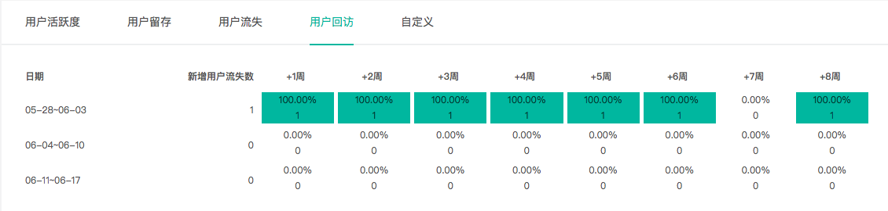

# 3.3.4访客忠诚

该展示提供用户活跃度、用户留存、用户流失和用户回访的数据，展示完整的访客生命周期，供您分析访客的忠诚度。可以了解到有多少访客是只来了一次就不再来了，有多少访客会经常来，又有多少访客会再次访问网站。

### 1、用户活跃度 

活跃度同留存是衡量一个产品用户粘性的基础指标。知了客户体验云所提供的活跃分析工具主要包括以下功能：

（1）默认新用户活跃度分析，系统默认将“新用户活跃度”定义为所选时间内使用过产品的新用户，统计监测该段时间内新用户活跃数量、活跃度等指标。

（2）自定义用户活跃分析，可结合具体业务需求，自定义满足“活跃”的条件，统计监测满足该条件的活跃用户数据，通过活跃行为的细分，掌握关键行为指标。

     产品用户管理的目标是：拉新、留存、促活、召回流失。仅仅通过吸引新用户扩大用户量还不够，还需要持续保持用户的活跃度，确保其能在产品中留存下来，并逐步称为产品的忠实用户，此外还需填补缺口，挽回流失用户。这样才能持久地为产品创造价值。

知了客户体验云提供活跃分析工具，统计产品的活跃情况，为您提高用户参与度和用户粘性提供参考。

应用场景举例：

某金融产品在众多渠道投放了广告，想知道哪个渠道带来的访客质量最高。自定义活跃度分析，建立了来自A渠道、B渠道用户的活跃度分析，对比得出最终来自B渠道的用户活跃度、日活/月活更高。但是这不能代表B渠道带来的用户质量是最高的，我们还要观察他们各个渠道的留存情况。自定义各个渠道的周留存分析，发现A渠道虽然活跃度低，但是周留存高。

提供用户日活/月活的数据趋势图和列表

（1）活跃用户的定义 在产品和业务中，一般对于“活跃用户”的定义，最基本的定义是访问或者登录过产品的用户；进一步也可以将做过产品核心价值功能的用户定义为“活跃用户”

 （2）活跃用户分析的价值 想要保持活跃用户持续增长，需要对活跃用户有一个较为整体性的了解。活跃用户分析，能帮助您洞察活跃用户的数量是怎么变化的？ 

（3）选择时间范围后，可以选择按时/天/周/月/年的颗粒度来查看。筛选完成后，展示符合活跃条件的昨日、过去 7 天、过去 30 天的用户量。

### 2、用户留存

 （1）留存分析简介 

留存分析是分析用户黏性、活跃度的重要方法。分析的是某一群组用户（通常为某批新用户）中再次产生指定行为的人数和比例。 

我们投入了大量的人力物力吸引客户访问我们的网站，但是一段时间后，只会有部分客户会留存下来。很可能吸引了大量的新用户，但是留下来的忠实用户却没有增长，甚至肯能会减少！推广期，留存用户的数据都被大量涌入的新用户数据覆盖掉，等到推广期过后才发现，网站的活跃用户依然没有提升。

 随着获客成本逐年递增，留存分析变得越来越重要，做好留存分析，才能为网站带来持续的流量增长。同时对流失用户针对性的调整推广/产品策略，也可以有效提高产品推广的ROI。 

一般我们讲的留存率，是指「目标用户」在一段时间内「回到网站/App 中完成某个行为」的比例。常见的指标有次日留存率、七日留存率、次周留存率等。比如：某个时间获取的「新用户」 的 「次日留存率」常用来度量拉新效果。

（2）留存分析数据分析方法 选择时间范围后，可以选择按时/天/周/月/年的颗粒度来查看。然后可以选择筛选条件对目标访客进行留存分析。

如图所示，表示2019年7月9日有62410名新用户访问了网站。第一天后有1.23%的访客继续访问，第二天后也有0.75%的访客继续访问，到第三天后，没有访客继续访问。

### 3、用户流失 

用户流失定义：某日/周/月的新增用户中，在第X日/周/月之后，未访问或登录过网站的访客数。 用户流失率定义：××天未登录的唯一用户数除以所选时间段的第一天总唯一用户数×100%； 默认按周、月为周期查看流失数据。

若流失周期选择一周，4月1日1000人访问/登录了您的网站，7日内有500人未再次访问/登录，即500人是流失用户。流失率：500/1000×100%=50%。

### 4、用户回访（即将推出此功能）

回访用户与回访率指的是““流失之后在此访问网站“的用户数量，及回访用户数占流失用户数的比例。即用户曾经流失过，满足流失时间期限内完全没有访问/登录网站的条件，但之后重新访问/登录网站。

