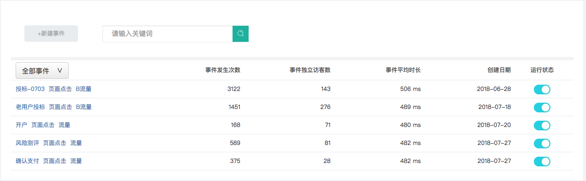
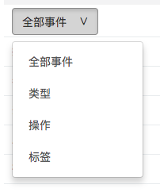

# 事件分析

### 1、什么是事件分析？

事件指的是用户在您产品上做了什么事，即用户行为，这种行为可以是任何事情，通常情况下，事件用于跟踪页面中元素的点击，如菜单、小部件、Flash元素、Ajax操作等等。常见的事件有：注册、登录、点击了某个按钮、浏览商品、添加购物车、分享了某篇文章等。

知了客户体验云提供事件分析工具，统计您网站的事件数据，可助您了解访客在您网站上的行为动态，为您优化网站交互元素提供参考。

### 2、如何设置事件？

知了客户体验云提供**代码埋点部署**的方式来采集用户行为数据，您可以根据您的业务需求灵活设置事件。

事件共有4个属性：Category类型、Action行为、Name名称、Value值。知了使用JavaScript代码来进行事件的统计监测,您可将以下代码添加到需要设置事件的\_paq数组中即可。

代码语法如下：

```javascript
<a href="#" onclick="javascript:_paq.push([‘trackEvent’,‘category’,‘action’, ‘name’,’value’]);">Freedom page</a>
```

参数说明：

| 参数 | 必填/选填 |                                                说明 |
| :--- | :---: | :--- |
| Category |           必填                    | 
  要监测的目标元素的类型名称，表示事件发生在谁身上，例如”视频”、“导航栏”、“链接”等。 |
| Action | 必填 | 用户与目标元素发生交互的行为操作，例如“播放“、“下载“、“点击“等。 |
| Name | 必填 | 事件名称，用于更详细的描述事件。 |
| Value | 必填 | 事件的相关数值信息，比如权重、时长、价格等。 |



 \_paq.push内顺序依次为Category类型、Action行为、Name名称、Value值，顺序不可打乱。可少填，优先级Category&gt;Action&gt;Name&gt;Value。


举例：

1）统计“Havana”这首歌的暂停事件：

```javascript
<a href="#" onclick="javascript:_paq.push([‘trackEvent’,‘video’,‘pause’, ‘Havana歌曲暂停’]);"> http://www.example.com</a>
```

2）统计某条链接的点击事件：

```javascript
<a href="#" onclick="javascript:_paq.push([‘trackEvent’,‘nav’,‘click’, ‘点击链接’]);"> http://www.example.com</a>
```

### 3、如何使用事件分析？

（1）事件列表页



布码设置完事件后，等待一段时间，事件分析页面就会有数据展示。在事件列表页中，您可对设置的事件进行管理。如果您不打算继续监测某一事件数据，您可在网页代码中删除该事件的监测代码，也可在该页面执行关闭操作，日后可以重新启用该事件的监测。

知了客户体验云中，事件主要由三个参数组成，分别是：类型、操作、标签。您可以根据需要，选择合适的参数维度查看事件数据。



（2）事件详情页

 为更好掌握事件触发的趋势变化，深入分析用户行为，您可在事件详情页中查看目标事件的详细数据，如：事件发生次数、事件独立访客数、事件平均时长。


4、表单能解决什么问题？

利用知了行为统计的“事件分析”，您可以对事件的触发情况进行跟踪监控，设置完事件后，您可以在事件分析页面查看相关的数据，观察事件数据趋势变化，以助您分析用户在产品中的行为，从而为产品优化提供参考。

应用场景举例：

（1）某活动运营期间，有多少用户点击了注册按钮，但未注册成功？

（2）有多少用户点击了视频播放按钮？

您可以通过事件设置，统计页面任意交互元素的触发情况。此外，您还可以配合转化、交叉、自定义留存、自定义活跃等功能，比较细分用户群体的行为差异，更好地满足您的业务需求。

   


  


