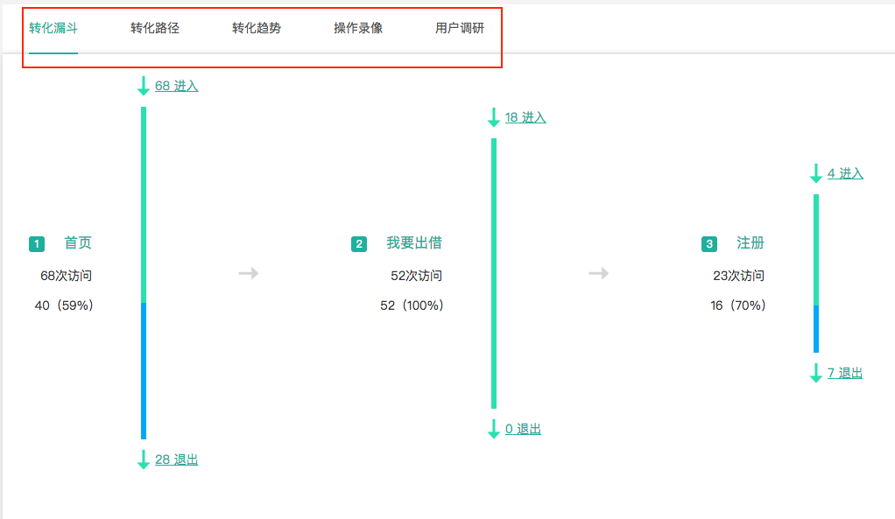
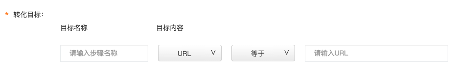
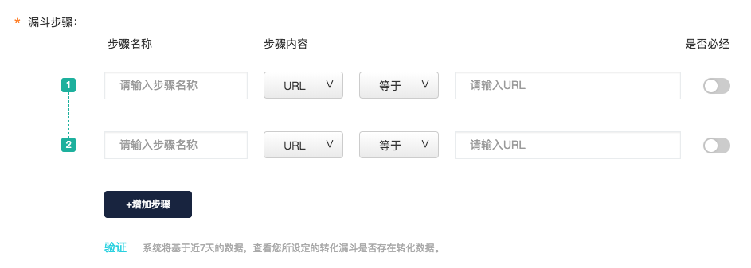
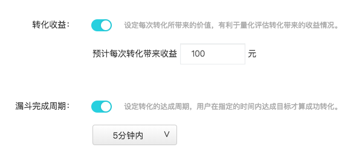
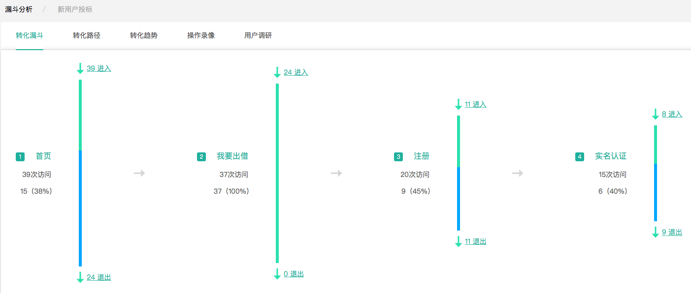
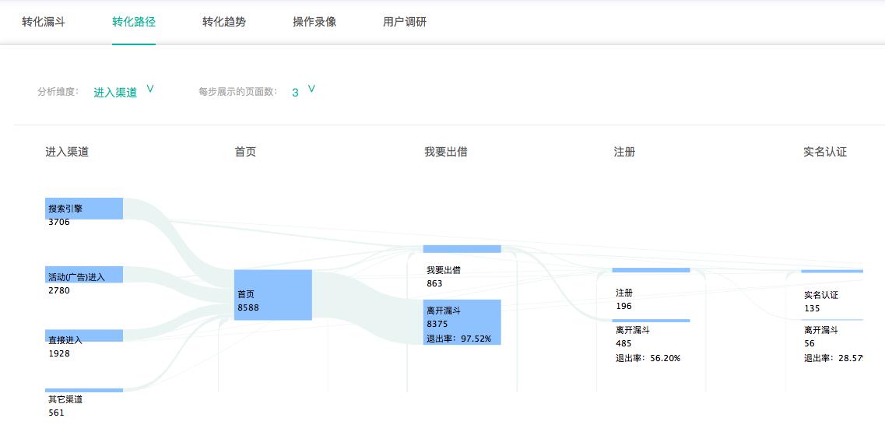
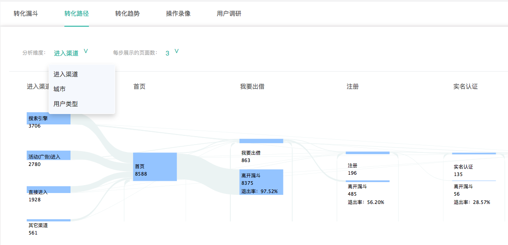

# 转化目标

### 1、什么是转化目标？

转化（conversion）是指用户成功地完成了某一目标行动。而目标是根据产品特性与业务场景而设置的，比如说用户注册、用户下载、用户购买等。

例如，对于电商网站而言，用户成功购买商品就意味着完成了一个转化目标。在知了客户体验云平台，您可以将任意一个希望用户完成的行为设定为转化目标，赋予其一个唯一的名称，则系统将会为您快速准确地监测和整理该转化目标的相关数据。

在知了客户体验云平台，设立转化目标并不仅仅是监测到目标的转化率，您可以查看到针对该转化目标最全面详尽的数据，且这些数据都以最便于分析的形式呈现出来。针对转化目标，知了客户体验云提供了五个分析维度：转化漏斗、转化路径、转化趋势、操作录像和用户调研。


**转化漏斗**：通过漏斗的形式查看用户在达成转化目标前所访问的每一步的用户进入与流失情况，可以迅速发掘出现问题的步骤，如退出率太高等。

**转化路径**：详细了解用户达成该转化目标所经过的路径情况，可以查看路径中每一个页面的情况，针对问题页面进行调研，主客观数据结合展示。

**转化趋势**：监测该转化目标的转化率、转化次数、转化人数、转化收益的历史趋势，可以通过历史趋势对营销活动或者产品优化的效果进行参考性的评估。

**操作录像**：针对进入转化漏斗/路径的用户进行录像监测，可以着重查看没有完成转化的用户在哪个地方的操作遇到了问题，并及时加以改进。

**用户调研**：不仅可以针对该转化目标进行调研，也可以对转化路径中的任意一个步骤进行调研，获取定性调研数据，与定量数据结合进行全面的分析。




### 2、如何设置转化目标？

```text
Step1: 点击页面左上方的“新建目标“按钮。
```

```text
Step2: 设置转化目标的条件，可以是一个事件，URL或页面集。
```



```text
Step3: 设置漏斗的步骤，包括是否必经的条件。
```



```text
Step4（选填）:设置转化收益与漏斗完成周期。 
```



### 3、转化漏斗

针对一个产品的转化目标，通常在转化流程中存在一些关键节点来达成此目标。如对于电商行业而言，若将“购买成功“作为转化目标，则“浏览商品“、“加入购物车“、“付款成功“这三个步骤会是达成这一转化目标的关键节点。



### 4、转化路径

路径是指访客在完成您所设定的转化目标前所经过的一系列页面或所需达成的一系列事件。转化路径依然使用桑基图进行呈现，且该桑基图可以展示用户的回流情况，即用户在到达某一步骤后没有继续往下，而是返回到了前面的步骤。

1）回流

回流代表用户在到达某一步骤后没有继续往下，而是返回到了前面的步骤。



2）筛选

针对转化路径，您可以对“分析维度“进行筛选，转化路径默认从“进入渠道“角度对流量进行分析，但用户可以根据数据分析的需求，选择其它的分析维度。



### 5、如何应用转化目标？

转化目标是根据产品特性与业务场景而设置的，比如说用户完成注册、下载、购买等即算作完成了转化，达成了转化目标。

在知了体验云系统中，设置转化目标是一个强大而重要的工具。在分析数据的过程中，您可以根据自身的产品特性设定特定的转化目标：如对于电商网站而言可能是“完成购买“。当你设置了这一目标后，您可以选择设定一些关键节点（即漏斗步骤），设定完成后，您即可查看到用户经过关键节点并达成转化目标的全部数据，包括流量趋势，关键节点数据等等。

对于转化目标的达成过程有两种查看方式：转化漏斗与转化路径。

转化漏斗以一种清晰的漏斗形式，展现出每个关键步骤的流入与流出数，您可以看到用户主要在哪个步骤流失的，并着重去优化该步骤，有效提高转化率。转化路径则是以桑基图的形式来呈现用户的流量趋势，转化路径比转化漏斗展示的信息更多更详细，您甚至可以看到用户在整个转化过程中的回流趋势，即用户可能在某一步骤出现了问题，停止了继续转化，并回流到了之前的步骤。如果某一步骤的回流用户数特别多，您可能要考虑是否在整个任务流程上出了问题。

