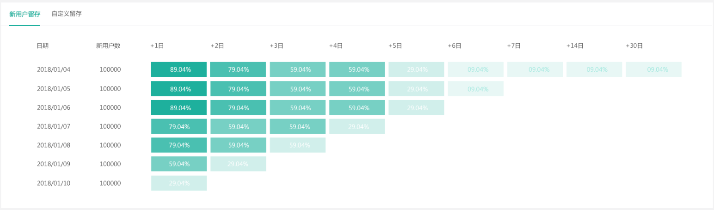
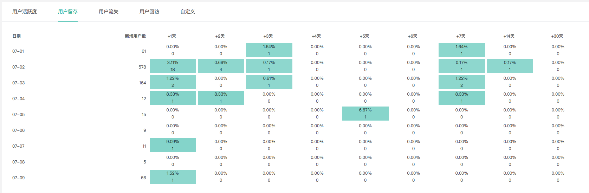
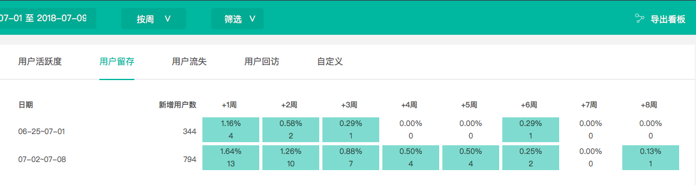
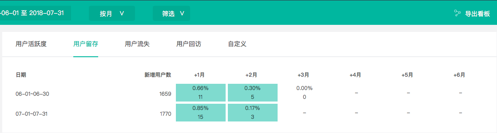

# 访客生命周期

### 1、活跃度

活跃度同留存是衡量一个产品用户粘性的基础指标。知了客户体验云所提供的活跃分析工具主要包括以下功能：

（1）默认新用户活跃度分析，系统默认将“新用户活跃度”定义为所选时间内使用过产品的新用户，统计监测该段时间内新用户活跃数量、活跃度等指标。

（2）自定义用户活跃分析，可结合具体业务需求，自定义满足“活跃”的条件，统计监测满足该条件的活跃用户数据，通过活跃行为的细分，掌握关键行为指标。

     产品用户管理的目标是：拉新、留存、促活、召回流失。仅仅通过吸引新用户扩大用户量还不够，还需要持续保持用户的活跃度，确保其能在产品中留存下来，并逐步称为产品的忠实用户，此外还需填补缺口，挽回流失用户。这样才能持久地为产品创造价值。

知了客户体验云提供活跃分析工具，统计产品的活跃情况，为您提高用户参与度和用户粘性提供参考。

应用场景举例：

某金融产品在众多渠道投放了广告，想知道哪个渠道带来的访客质量最高。自定义活跃度分析，建立了来自A渠道、B渠道用户的活跃度分析，对比得出最终来自B渠道的用户活跃度、日活/月活更高。但是这不能代表B渠道带来的用户质量是最高的，我们还要观察他们各个渠道的留存情况。自定义各个渠道的周留存分析，发现A渠道虽然活跃度低，但是周留存高。

### 2、留存

知了客户体验云所提供的留存分析工具，可以统计您“满足初始行为的目标用户”在一段时间后“回到产品中完成回访行为”的数量和比例。例如：自定义留存购买成功用户周留存情况，初始行为：购买成功，回访行为：购买成功。

   留存是AARRR模型中的重要环节，是衡量产品健康度的重要指标。

主要包括以下功能：

（1）**新用户留存分析。**系统默认初始条件为首次来访的新用户，回访行为为“来访“，统计监测的指标为“新用户留存率“。

（2）**自定义用户留存分析。**您可结合您的业务需求，自定义初始行为和回访行为，实现精准、细化的留存分析。

  通常我们可以根据获客时间、获客渠道、用户行为、用户分群来自定义留存分析。

在留存数据图表中，您可查看详细的留存用户数和留存率。知了客户体验云提供按天、按周、按月三种形式报告留存数据：

（1）按天，指按自然天统计完成起始行为的目标用户量，并按天来观测后续每天的留存情况，默认报告+1天，+2天，+3天，+4天，+5天，+6天，+7天，+14天，+30天。

（2）按周，指按自然周统计完成起始行为的目标用户量，并按周来观测后续每天的留存情况，默认报告+1周，+2周，+3周，+4周，+5周，+6周，+7周，+8周。

（3）按月，指按自然月统计完成起始行为的目标用户量，并按月来观测后续每天的留存情况，默认报告+1月，+2月，+3月，+4月，+5月，+6月。

### 3、流失

用户流失数与流失率指的是“某段时间的新增用户中，在第X日/周/月后未访问或登陆过网站”的数量和比例。例如：自定义2周后未访问或登陆过网站的用户即为流失用户。

流失率也可以按天/周/月进行统计。

### 

