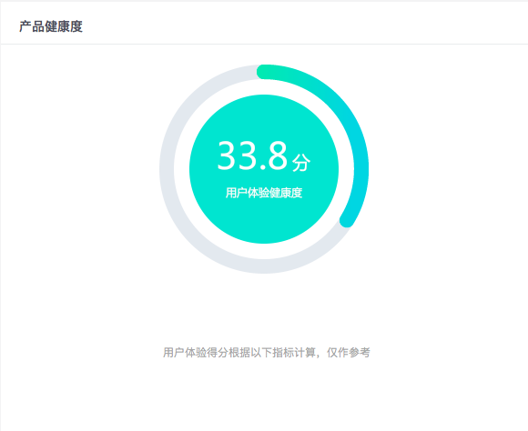
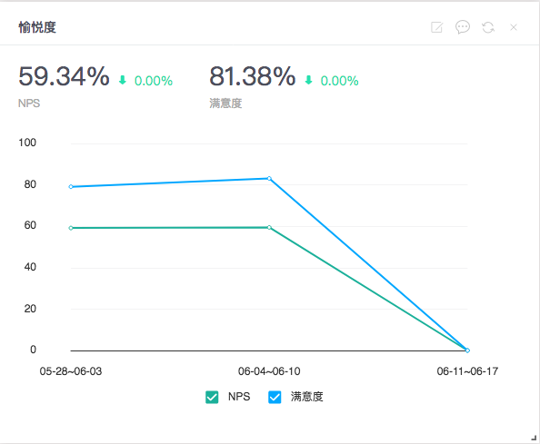
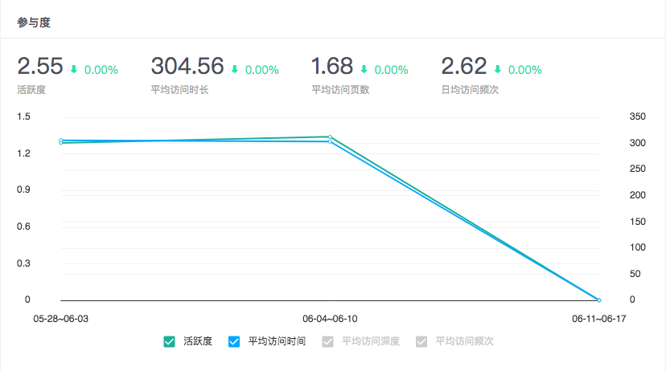
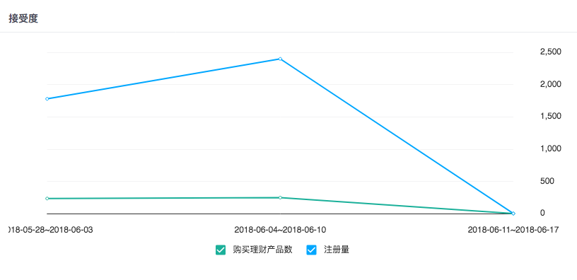
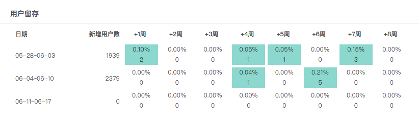
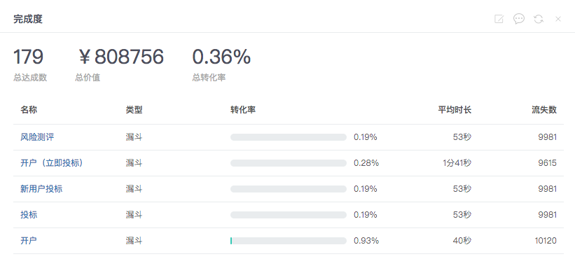

# 客户体验健康度

### 1、何为客户体验健康度？

客户体验健康度是知了体验云独创的算法体系，通过愉悦度、参与度、接受度、留存度以及完成度5个度量标准，共同构成对产品的客户体验健康度的评价体系。您可以通过查看产品的用户体验健康度状况以及变化趋势，来辅助作出产品、市场以及运营方面的决策。

### 2、五大度量指标

**愉悦度**：是指用户的主观感受，“很有用、很好用、很漂亮、我会推荐好友”等都是产品或者服务的愉悦度好的表现。愉悦度可以从四方面衡量，包括有用性、易用性、视觉感受、向别人推荐的意愿。我们采用NPS调研、满意度调研两种形式来度量用户的主观感受。

**参与度**：是指用户在产品或者服务中的参与深度。在互联网产品中，通常用一段时间内的活跃用户数、平均访问频次、平均访问时长、平均访问深度等指标综合评估。

**接受度**：是指用户接纳并真正使用产品。可以从“访问周期”和“用户行为”两方面来评估用户真正接纳产品，例如：在一周内2次打开app且停留时间超过3分钟的，即为接受该产品。或者以用户行为来判断，例如：注册成为会员或付费购买等，只要用户完成某项设定的为判断接受度的事件即为接受产品。

**留存度**：是指在某一统计时段内的新增用户数中再经过一段时间后仍使用该产品或服务的用户比例，通常以留存率来衡量。例如，今天有1000名新用户在未来30天后依然活跃的用户数为236人，其留存度即为23.6%。

**完成度**：是指用户完成关键任务的情况，包括完成率、平均所需时间、产生错误次数三个指标。例如：每天尝试注册的人数有1000人，成功完成注册有200人，完成率即为20%，平均所花时间是1分25秒，其中错误次数是369次。以此来评估产品关键任务设计的效果、效率和满意度如何。

