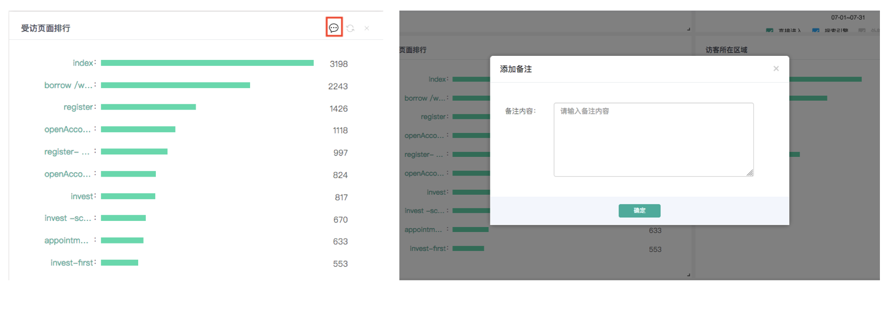
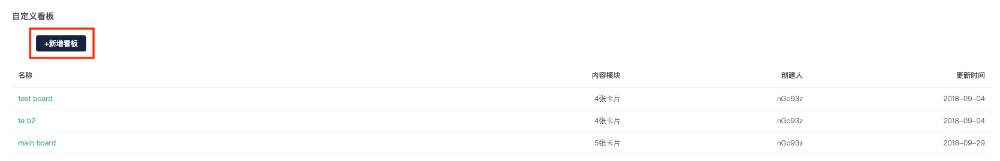
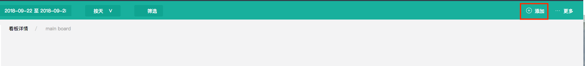
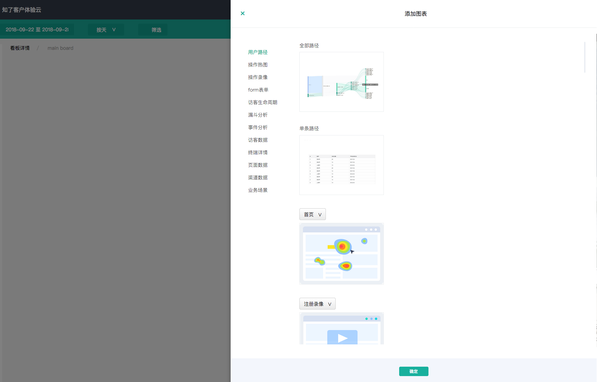

# 自定义看板

### 1、什么是自定义看板？

在知了客户体验云中，除了系统默认的运营看板、健康度看板、以及实时看板之外，您还可以根据自身的业务需求新建专属于自己的看板。

在自定义看板中，您可以将系统中任意功能模块中的数据导入到看板，并可根据个人喜好调节看板的大小排版样式，对数据卡片进行备注等等。



### 2、如何新建看板？

```text
Step1：点击左上方的“新建看板“按钮，即可新建一个看板，您已经自定义完成的看板都会以表格的形式展示出来。
```



```text
Step2：新建看板后，您将获得一个空白的看板，点击页面右上方的添加按钮，即可自定义添加数据卡片。
```






