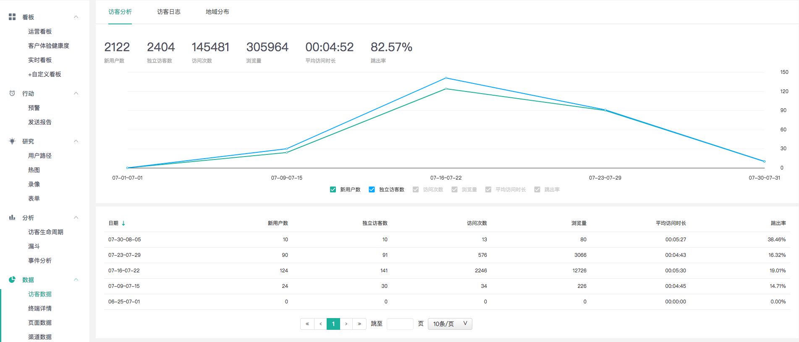
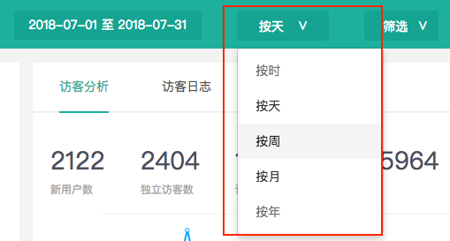
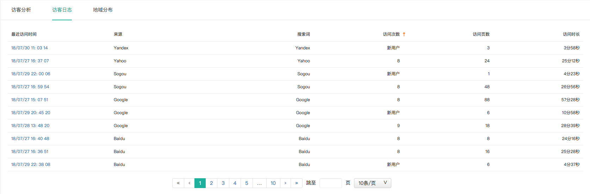
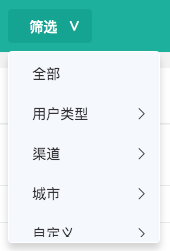
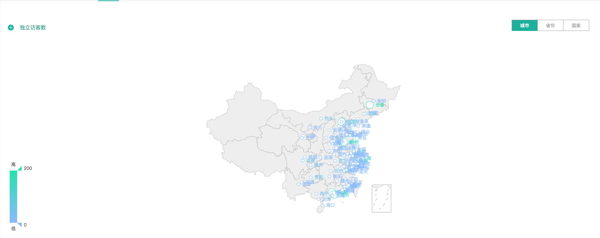
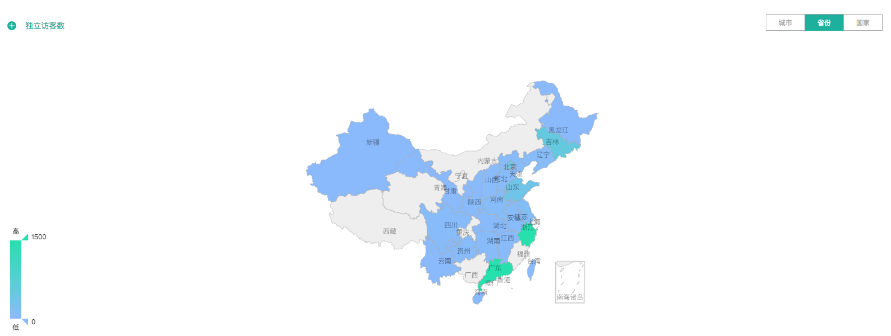
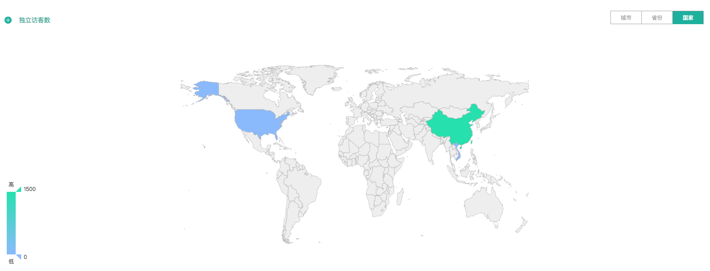

# 访客数据

### 1、访客分析

知了客户体验云可根据您选定的时间段，提供您网站的流量访问情况，通过流量的时间趋势变化，可助您了解网站的访问情况和访问规律，更好地实施运营策略。

具体的流量指标有：新用户数、独立访客数、访问次数、浏览量、平均访问时长、跳出率。

知了客户体验云所展示的指标都属于数据分析中最为重要的一类数据，通过以上6个核心数据，就可以对产品的状况有一个概括性地了解。具体指标所涵盖的分析意义如下：


**新用户数：**了解产品每天获取新用户的情况；

**独立访客数：**产品在所选时间段内的全部访客数量；

**访问次数：**体现产品对用户吸引力的一个重要指标。访问次数越多，表明用户对产品越认可。

**浏览量：**衡量产品流量大小的重要指标。

**平均访问时长：**所有用户从进入网站到退出网站的平均时长。文娱产品如视频App，比较关注用户的平均访问时长，时长越长表明产品对用户吸引力越大。

**跳出率：**访客仅到达着陆页就离开网站/App的访问次数占所有访问次数的比率。跳出率通常是衡量访问质量的一个指标，可以用于指导网站/App着陆页的优化。


查看路径：请点击**数据&gt;&gt;访客数据&gt;&gt;访客分析&gt;&gt;设置时间和筛选条件。**

可以根据业务需要，细分时间维度进行数据查看。知了客户体验云提供多种细分维度：按小时、按天、按周、按月、按年。

### 2、访客日志

在访客日志中，您可以查看所选时间段内的所有访客的访问状态、信息资料和操作记录。

例如您选择查看2018-07-10当天的访客日志，则表格中会列出从00：00：00-23：59：59的访客数据。

针对访客日志表格，您可以通过两种方式找到符合您条件的用户进行查看。

1）通过页面上方的筛选框进行精准筛选；

2）通过对访问次数、访问页数、访问时长三个指标进行正序或倒序筛选。


如果一个访客在所选时间段内有多次访问行为，则表格上将显示最后一次的访问记录。该访客的其它次访问记录可以点击进入访客日志详情进行查看。


### 

针对目标访客，您可以查看该目标访客的档案资料，清晰地展示了用户与产品的整个交互过程。 访客在产品内的行为轨迹可以帮助你了解用户是如何使用你产品的。

在访客档案中，您可以查看目标访客的详细资料及其访问行为记录，如下：

左侧显示了该用户的详细资料，包括用户ID、实时访问状态、历史访问数据概览等。

右侧显示该用户在最近活跃一天的详细访问记录，每一次访问中的页面路径都会被记录下来，您可以查看详细的录像操作记录。

### 3、地域分布

知了客户体验云提供各地区访客的访问数据，可供您了解网站访客的地域分布情况，并可根据地域特征针对性地实施推广和运营方案。

访客地域分布图的查看方式有三种：按城市、按省份、按国家。您可从不同的维度对访客的分布状况进行不同层级的分析。

  

