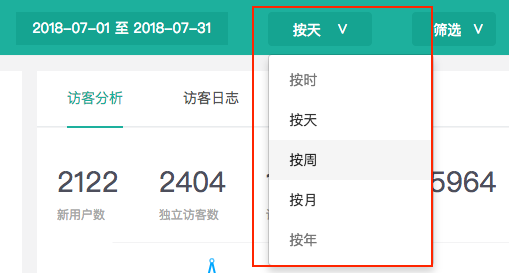

# 2.1.1 访客分析

知了客户体验云可根据您选定的时间段，提供您网站的流量访问情况，通过流量的时间趋势变化，可助您了解网站的访问情况和访问规律，更好地实施运营策略。

具体的流量指标有：新用户数、独立访客数、访问次数、浏览量、平均访问时长、跳出率。

知了客户体验云所展示的指标都属于数据分析中最为重要的一类数据，通过以上6个核心数据，就可以对产品的状况有一个概括性地了解。具体指标所涵盖的分析意义如下：


**新用户数：**了解产品每天获取新用户的情况；

**独立访客数：**产品在所选时间段内的全部访客数量；

**访问次数：**体现产品对用户吸引力的一个重要指标。访问次数越多，表明用户对产品越认可。

**浏览量：**衡量产品流量大小的重要指标。

**平均访问时长：**所有用户从进入网站到退出网站的平均时长。文娱产品如视频App，比较关注用户的平均访问时长，时长越长表明产品对用户吸引力越大。

**跳出率：**访客仅到达着陆页就离开网站/App的访问次数占所有访问次数的比率。跳出率通常是衡量访问质量的一个指标，可以用于指导网站/App着陆页的优化。


查看路径：请点击**数据&gt;&gt;访客数据&gt;&gt;访客分析&gt;&gt;设置时间和筛选条件。**

可以根据业务需要，细分时间维度进行数据查看。知了客户体验云提供多种细分维度：按小时、按天、按周、按月、按年。

### 

