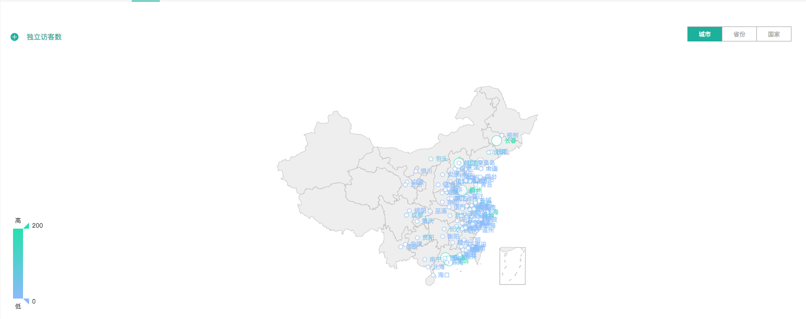
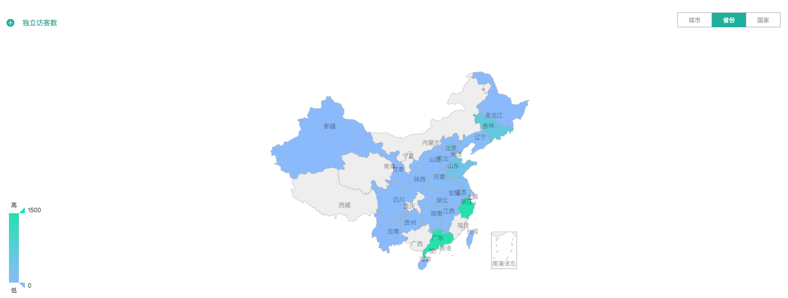

# 2.1.4 地域分布

知了客户体验云提供各地区访客的访问数据，可供您了解网站访客的地域分布情况，并可根据地域特征针对性地实施推广和运营方案。

访客地域分布图的查看方式有三种：按城市、按省份、按国家。您可从不同的维度对访客的分布状况进行不同层级的分析。

知了客户体验云提供网站访客所使用的设备终端的配置情况，包括：设备类型、浏览器、操作系统、分辨率、设备品牌等，旨在为您网站设计提供参考，以更好地优化您网站的兼容性和交互体验。‌

