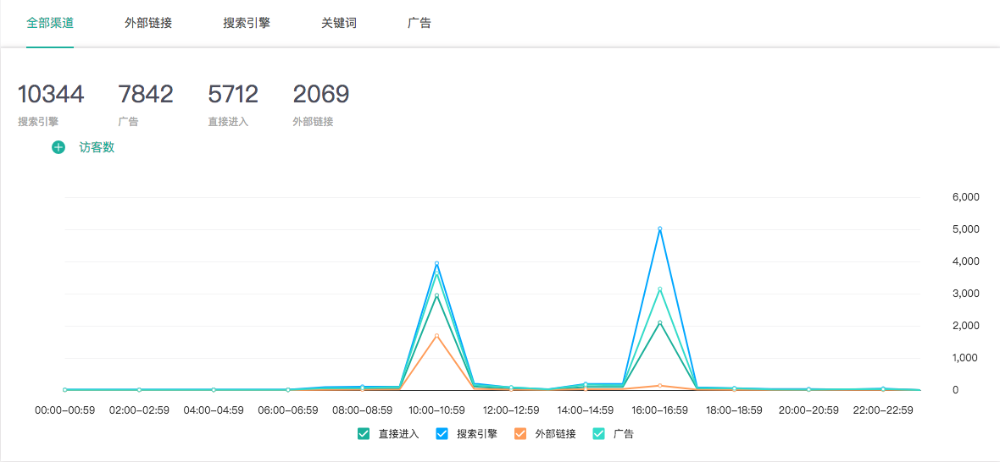

# 渠道数据

### 1、全部渠道

知了客户体验云提供您网站上流量的渠道分布情况，主要包括直接访问、搜索引擎和外部链接，在全部渠道页面，您可了解哪些渠道的流量来源更多，效果更好，为合理优化网络推广渠道提供参考。

（1）**直接访问**：
 访客直接在浏览器中输入网址、点击收藏的网址链接、通过flash、弹窗等无法获取来源的方式打开网址，都被记录为直接访问。

（2）**搜索引擎**：
访客通过在搜索引擎中输入关键词搜索，并在搜索结果页点击链接进入您的网站，则被记录为搜索引擎来源。无关键词搜索的访问则被记录为其他外部链接中。

（3）**外部链接**：
通过除搜索引擎之外的网站上的链接访问您网站的都被记录为外部链接。

（4）**广告**：各类媒介推广渠道所带来的流量情况。

### 2、外部链接

外部链接报告中，您可查看具体是哪些网站给您网站带来了流量。

趋势图展示了关键外部链接给您网站带来的流量趋势变化，您可通过下拉筛选选择您关注的指标，展示的数据为给您网站带来流量最多的前五个外部链接。

### 3、搜索引擎

 搜索引擎报告可以让您了解各个搜索引擎给您网站带来的流量情况，可查看哪种搜索引擎能给您网站带来更多的流量，哪种搜索引擎来源的访客流量质量不佳，并结合业务分析背后的原因，从而为营销推广策略的制定提供参考，在优质搜索引擎上分配更多的预算，避免盲目推广。

### 4、关键词


知了客户体验云平台使用文字云的形式，直观的为您展示访客在搜索引擎进入产品时最常使用的关键词。并结合下方的数据表格为您展示详细的数据分布情况。

关键词报告可以查看访客在各种搜索引擎上使用的搜索关键词以及这些关键词给您的网站带来的流量情况，可助您分析哪些关键词搜索频次高、哪些关键词带来的流量大、哪些关键词带来的用户质量高、访客最关注哪些网站信息等，为您设计搜索引擎关键词广告提供参考依据。

### 5、广告

 广告流量跟踪报告，将提供各类媒介推广渠道给您网站带来的流量情况，可助您分析哪种媒介推广能够给您产品带来更多的流量，哪种媒介推广带来的流量质量较高，为您在各类媒介上的营销推广设计提供参考。

基于各种媒介推广带来的不同流量及流量质量，您可以进一步比较分析在各种媒介上的关键词和创意，了解哪些关键词和创意更能够吸引访客，哪些关键词和创意还需要进一步优化以及如何优化等等。通过不断地比较分析各类媒介推广方式，您可以不断提升整体的网络营销效果。

