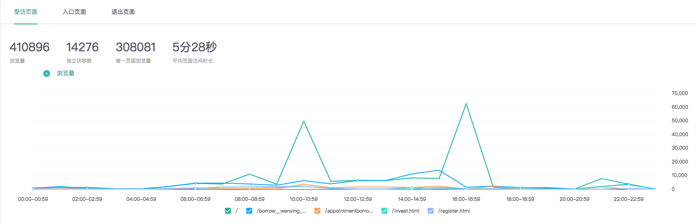
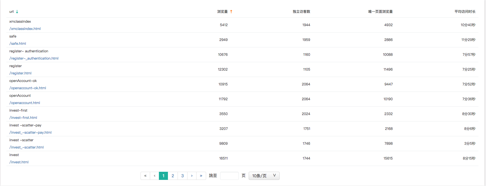
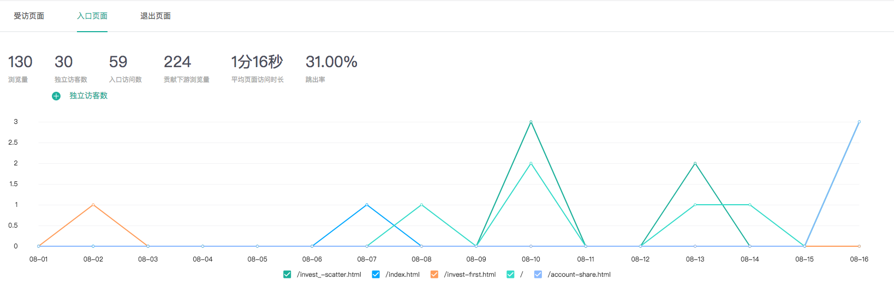
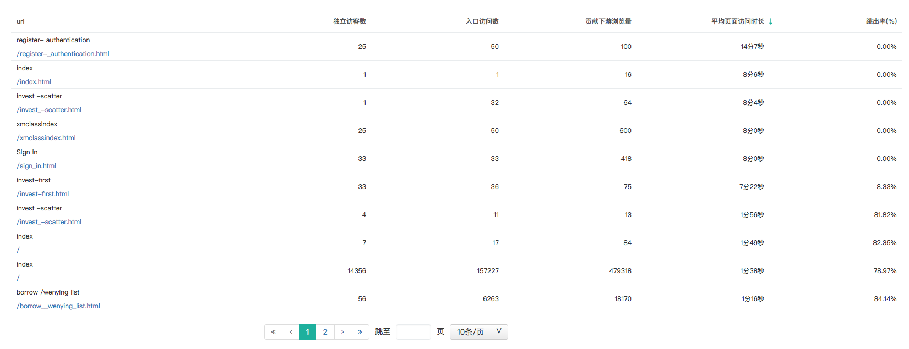
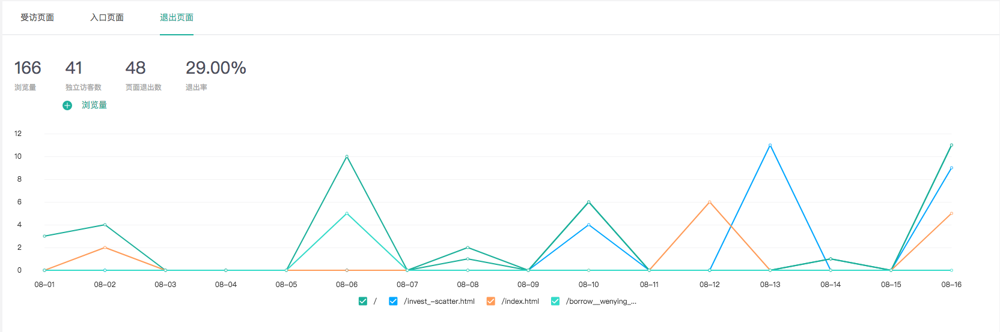
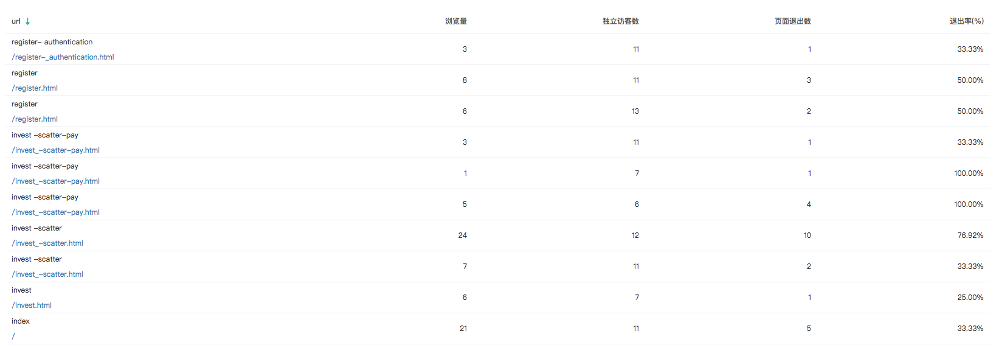
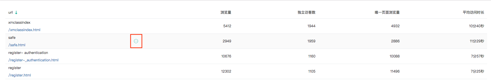
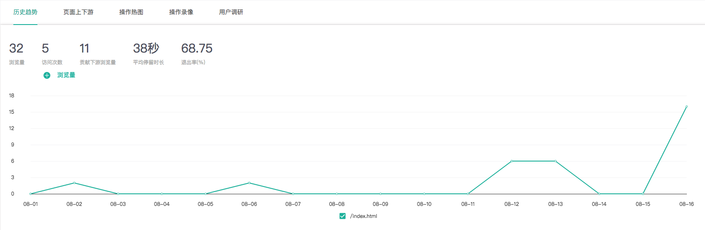
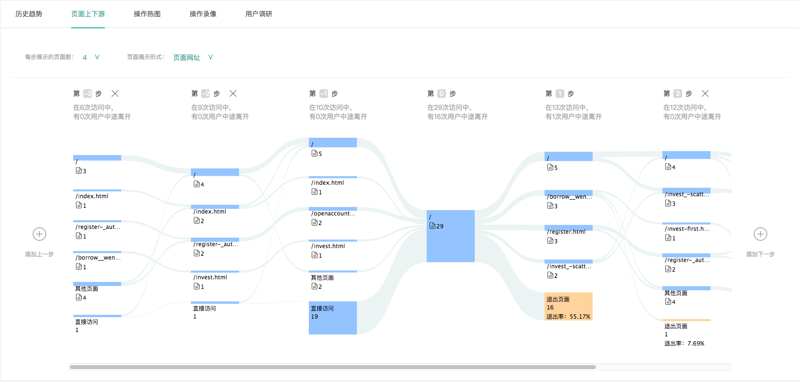

# 页面数据

### 1、受访页面

知了客户体验云提供访客在您网站中各个页面的访问情况，为您优化网站页面提供参考依据。重点考量“浏览量“、“独立访客数“、“唯一页面浏览量“和“平均页面访问时长“四个指标。

趋势图展示了重要页面的流量趋势变化，您可通过下拉筛选选择您关注的指标，展示的页面为所选时间段内该指标排名前五的页面。

数据表格展示了所有受访页面的流量数据情况，您可以通过表格排序功能，快速筛选关键指标排名靠前的页面。

### 2、入口页面

入口页面，也叫着陆页（Landing page），指访客每次访问您网站的第一个受访页面。入口页分析重点考量“浏览量“、“独立访客数“、“贡献下游浏览量“、“入口访问数“、“平均页面访问时长“、“跳出率“；

入口页面是访客形成对您网站第一印象的重要页面，关系到访客是否会继续关注您的网站、最终是否会选择您的产品或服务。因此，提升入口页面的质量对您网站具有重要的意义，您可找出对访客最有吸引力的入口页面，采取措施，重点优化，以提升入口页面对网站流量的贡献力。

趋势图展示了重要入口页面的流量趋势变化，您可通过下拉筛选选择您关注的指标，展示的页面为所选时间段内该指标排名前五的入口页面。

数据表格则展示了所有入口页面的流量数据情况，您可通过把表格排序功能快速筛选关键指标排名靠前的页面。关键指标如下：独立访客数、入口访问数、贡献下游浏览量、平均页面访问时长、跳出率。


**入口访问数**：
 指用户从当前入口页面进入网站的访问次数。该指标越高，说明该入口页面更容易被访客访问，因此针对入口页访问次数高的页面，需要重点优化。

**贡献下游浏览量**：
指从当前入口页面进入网站，当前入口页面给下游页面带去的浏览量总和。该指标越高，该入口页面质量越好，越能吸引访客访问网站更多的页面。

**平均页面访问时长**：
指从该入口页面进入网站的访客平均每次访问的时长，该指标越高，说明页面对用户的吸引力越强。

**跳出率**：
跳出意味着访客只看过您网站的入口页面就选择离开，一定程度上可以评估访客对您网站的第一印象，跳出率越高表示该入口页面对访客的吸引力越弱。针对跳出率高的页面，需要重点研究，查看这些页面的内容和布局结构，探索访客离开的原因。


### 3、退出页面

退出页面指的是访客离开您网站时访问的最后一个页面。退出页分析重点考量“浏览量“、“独立访客数“、“页面退出数“、“退出率“。

一些页面因其处在业务流程的终点，如注册完成页面、结算完成页面等，它们的退出率高是正常现象。其他页面的退出率高则代表着这些页面可能存在问题，比如显示出错、加载速度慢、页面设计不佳等，需要重点关注，及时明确退出率居高的原因，及时优化，挽留更多的用户。

趋势图展示了重要退出页面的流量趋势变化，您可通过下拉筛选选择您关注的指标，展示的页面为所选时间段内该指标排名前五的退出页面。

数据表格展示了所有退出页面的流量数据情况，您可通过把表格排序功能快速筛选关键指标排名靠前的页面。关键指标如下：浏览量、独立访客数、页面退出数、退出率。


页面退出数：指访客从当前页面退出网站的访问次数；

退出率：指从当前页面退出网站的次数占当前网页访问次数的百分比。


对于退出数或退出率很高的页面，需要结合页面类型具体分析。如果某一页面是某条业务流的终点页面，可以设法在该页面增加更多的服务链接，吸引用户点击访问。如果是首页或活动页面，则需要针对该页面的响应情况、页面内容、布局、视觉设计、用户体验等进行详细分析，探究用户离开的原因，及时优化。

### 4、页面详情

针对页面数据模块的任一表格（包括受访页面、入口页面与退出页面），鼠标停留在表格任意一行，则会出现页面详情按钮，如下图所示：

点击“页面详情“按钮，则可进入该页面的详情页，查看该页面的历史趋势、页面上下游、热图、录像以及调研结果（如有）。

通过历史趋势变化图，您可以监督该页面重要指标的变化情况，评判相关运营推广活动或页面改版的效果。

### 5、页面上下游

页面上下游是通过桑基图的形式，展示页面的上下游页面数据。通过上下游数据，您可了解访客从哪里来，又去向哪里，有效判断该页面对网站流量的贡献价值，并可据此采取有效的推广措施。

