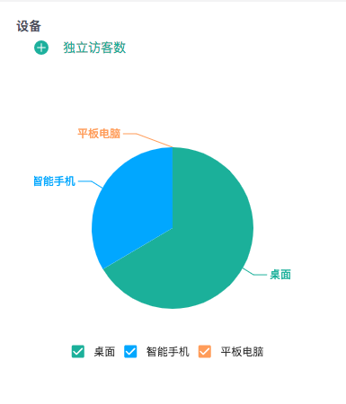

# 终端详情

知了客户体验云提供网站访客所使用的设备终端的配置情况，包括：设备类型、浏览器、操作系统、分辨率、设备品牌等，旨在为您网站设计提供参考，以更好地优化您网站的兼容性和交互体验。

### 1、设备类型

设备类型主要划分为三种：桌面、智能手机和平板电脑。

### 2、浏览器

知了客户统计云能够统计到用户所使用的所有浏览器类型。包括：Google Chrome、火狐浏览器、百度浏览器、360浏览器、Safari、UC浏览器、搜狗浏览器、Opera浏览器等。

### 3、操作系统

对于用户所使用设备的操作系统的统计，知了用户体验云同样能达到精确的维度。首先进行大类地划分为：Windows系统、Mac OS系统、IOS系统、Android系统等，再在以上大类的基础上进行进一步细分，精确到用户所使用的系统的版本，如IOS 10.3、 IOS 8.4等。

### 4、分辨率

知了客户体验云对于用户所使用设备分辨率的统计包含：360\*640、1024\*768、1280\*1024、1366\*768、1440\*990、1920\*1080。

### 5、设备品牌

对于设备品牌的统计，即统计用户所使用手机、平板、电脑的品牌，如Apple、华为、小米、魅族等。

  

  

