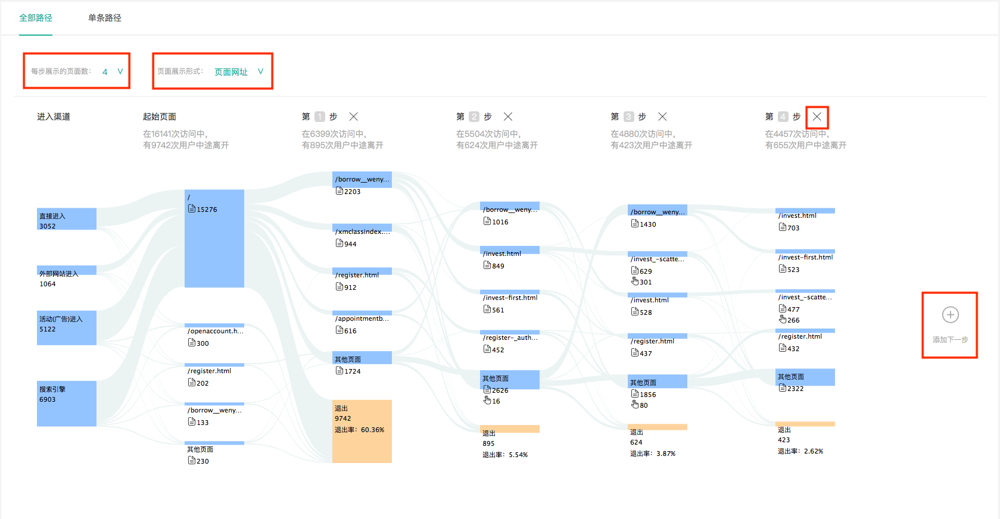
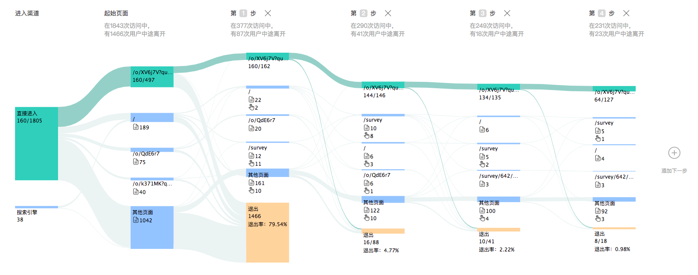
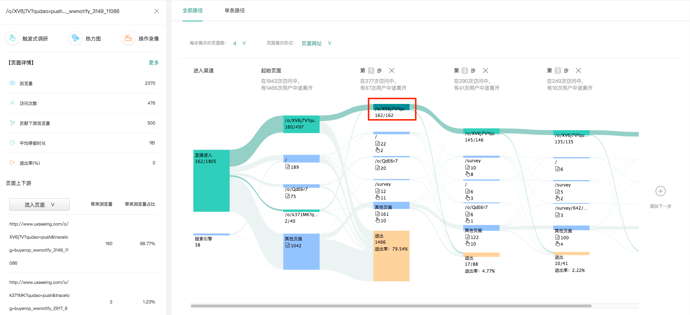

# 2.3做了哪些事

#### 2.3.1漏斗分析

 漏斗转化是指是指用户成功地完成了某一目标行动。而目标是根据产品特性与业务场景而设置的，比如说用户注册、用户下载、用户购买等。 

例如，对于电商网站而言，用户成功购买商品就意味着完成了一个转化目标。在知了客户体验云平台，您可以将任意一个希望用户完成的行为设定为转化目标，赋予其一个唯一的名称，则系统将会为您快速准确地监测和整理该转化目标的相关数据。 

在知了客户体验云平台，设立转化目标并不仅仅是监测到目标的转化率，您可以查看到针对该转化目标最全面详尽的数据，访问次数、转化次数、流失数、转化率、转化时长；且这些数据都以最便于分析的形式呈现出来。针对转化目标，知了客户体验云提供了三个分析维度的主客观双数据分析：转化漏斗、转化趋势、用户调研。

#### 2.3.2路径

 通过用户路径，你可以查看用户在上访问的真实路径。了解用户是否按照你所设计的转化流程在进行浏览与操作。通过路径的“页面浏览量”“访客数”“页面退出率”等数据指标，可以了解用户在哪一页面遇到了问题，哪个页面阻碍了用户完成转化等等。根据这些信息，您可以有针对性地改进你的产品，从而高效地提升转化。

（1）全部路径

 全部路径：是整个产品的用户所访问过的所有真实路径的集合。可以查看整个产品的用户路径走向。单条路径则是将用户的所有真实路径以单条的形式呈现，可以按访问次数、访问深度、平均访问时长排序查看路径。

如何查看全部路径？

点击左侧功能栏“用户路径”可以进入用户路径模块，默认显示“全部路径“，如下图所示。

**功能点一：桑基图上方有两个筛选框：**

 每步展示的页面数；例如，如果选择每步展示页面数为4，则下方桑基图每列（纵向）会展示访问量最高的4个页面，剩余页面则被归为其他页面中。

 页面展示形式：页面展示形式有2种：页面网址与页面标题。选择页面网址则下方的桑基图上会显示每个页面的URL，选择页面标题，则会显示页面的名称。

**功能点二：桑基图有添加步骤与删减步骤的功能：**

 添加下一步：点击桑基图最右侧的➕按钮，则会展开桑基图的下一步。

 删减步骤：在桑基图的每个步骤上方有一个❌号，点击叉号即可删减该步骤。

**功能点三：高亮功能**

点击桑基图中任意一段连线，可以高亮所有经过该路径连线的页面及流量。

点击桑基图中任意一个页面，可以高亮所有经过该页面的路径情况，同时页面左侧会出现侧边栏，显示该页面的详情数据：包括页面数据，页面上下游，页面调研结果等。

（2）单条路径

单条路径表格展示的是用户所访问过的所有真实的路径，可以通过访问深度、访问量、平均访问时长三个维度，对路径进行排序，筛选出您想要查看的用户路径。

（3）用户路径的应用场景？ 

用户路径的使用场景有很多，其最核心的功能就是帮助我们了解产品的用户在真实使用场景下是如何访问产品的，可以帮助我们对产品进行有针对性的改进，以提高用户体验与用户转化率。以下是用户路径应用场景的举例说明：

 了解用户进行购买或转化的真实路径，查看用户是否有按照产品所设计的流程进行访问。

 探究用户访问的路径中转化率最高与最低的分别是哪条路径，应该考虑更加优化转化率高的路径，改进转化率低的路径；

#### 2.3.3 操作热图

 （1）操作热图简介 操作热图\(heatmap\)是以热谱图展示用户在页面点击或浏览行为的图示。借助热图，您可以直观地查看特定页面内用户所有点击，鼠标移动和滚动。例如，这可以帮助您找出用户更关注那些内容，判断关键内容是否被用户所接受。 知了行为统计提供的热力图支持三种模式：点击热图、浏览热图、分屏热图。 

（2）操作热图的类型 

点击热图\(Click and Tap Heatmaps\)

点击热图可以帮助您确定用户点击的位置。如果他们在移动设备/平板电脑上使用，他们的触屏动作也会被记录。点击热图可以帮助您快速发现网页的问题： 例如，用户是否点击了您希望他们点击的区域？ 

浏览热图（Move Heatmaps）

分屏热图（Scroll Heatmaps）

通过分屏热图掌握每屏内容对于用户的吸引力，我们都知道用户浏览行为可能越往下浏览率越低，但是具体情况如何，一直没有实际的数据支撑。分屏热图创新性的将每一屏的浏览用户数和比例直观的展现出来。因此在产品功能、页面内容的展示方面，可以根据分屏热图进行优化，提高重要信息的曝光度。 首屏对用户的第一印象决定了用户是否有兴趣继续向下浏览，如果通过分屏热图发现首屏到第二屏流失非常高，那就应该考虑优化首屏的展示效果了。

（3）应用场景 

某保险公司的报价着落页更新改版后，访问时长数据、跳出率等数据与之前老版相差无几，但是转化率比之前低。设置操作热图后，通过浏览热图发现用户的视觉焦点并非落在报价计算器中，而是被其他视觉元素所吸引。通过观察点击热图发现报价计算器中的点击数量远低于界面其他元素。证明用户都点击其他元素跳转流失了。通过优化设计，减弱了界面其他视觉元素的干扰，突出报价计算器视觉效果。优化后转化率比优化前转化提升了200%。

#### 2.3.4 操作录像

 （1）操作录像简介

 通过会话录制，您可以查看用户在产品上的所有活动，例如点击，鼠标移动，滚动，窗口大小调整，页面更改以及特定页面上真实访问者的表单交互。您可以在视频中重播这些互动，以准确了解用户与您产品的互动方式。通过这种方式，您可以了解他们的期望，他们可能遇到的问题，使用模式等。

（2）应用场景 应用场景

XXX金融产品新推出的一个信用测评的功能，需要做可用性测试，知了客户行为分析中建立操作录像进行可用性测试，观察用户对新功能的接受度。传统可用性测试需要邀请用户到实验室、分配任务、录像费时费力。在实验室环境中非真实场景下测试存在一定偏差。操作录像可以替代传统的可用性测试，真实场景、真实用户、缩短测试时间、降低测试成本。

#### 2.3.5 表单分析

 常见的表单有注册表单、登录表单、添加购物车表单等，用于收集不同类型的用户输入。表单中的元素通常有以下几种：文本域、下拉列表、单选框、复选框、提交按钮等。 知了客户体验云提供在线表单分析工具，统计您网站的表单数据，可助您了解访客与表单的互动情况，为您优化表单设计提供参考。主要包括以下功能：

 （1）表单访问、填写、提交、转化情况分析。主要的数据指标有表单浏览量/独立访客数、表单填写率、表单提交率、表单重新提交率、表单转化率。 

（2）访客与表单中各个字段的交互情况分析。主要的分析维度有七个：用户最先填写的表单项；导致用户放弃填写的表单项；用户在每个表单项交互的时长（包括耗费时长与犹豫时长）；每个表单项的填写次数；每个表单项的修改次数；每个表单项的留空次数。 

（3）表单所在的页面访问情况。同一表单可能会存在于不同页面被用户访问，知了客户体验云将对不同页面上的表单被访问情况进行数据统计，帮助分析不同页面上表单的填写率与转化率是否有不同。

#### 2.3.6 页面

（1）受访页面

知了客户体验云提供访客在您网站中各个页面的访问情况，为您优化网站页面提供参考依据。重点考量“浏览量“、“独立访客数“、“唯一页面浏览量“和“平均页面访问时长“四个指标。

趋势图展示了重要页面的流量趋势变化，您可通过下拉筛选选择您关注的指标，展示的页面为所选时间段内该指标排名前五的页面。

（2）入口页面

入口页面，也叫着陆页（Landing page），指访客每次访问您网站的第一个受访页面。入口页分析：重点考量访客数、访问次数、贡献下游浏览量和入口页次数、平均访问时长、跳出率； 入口页面是访客形成对您网站第一印象的重要页面，关系到访客是否会继续关注您的网站、最终是否会选择您的产品或服务。因此，提升入口页面的质量对您网站具有重要的意义，您可找出对访客最有吸引力的入口页面，采取措施，重点优化，以提升入口页面对网站流量的贡献力。 趋势图展示了重要入口页面的流量趋势变化，您可通过下拉筛选访客数、访问次数、贡献下游浏览量和入口页次数、平均访问时长、跳出率；选择您关注的指标，展示的页面为所选时间段内该指标排名前五的入口页面。

（3）退出页面 

退出页面指的是访客离开您网站时访问的最后一个页面。退出页分析：重点考量浏览量、访客数、退出数和退出率； 一些页面因其处在业务流程的终点，如注册完成页面、结算完成页面等，它们的退出率高是正常现象。其他页面的退出率高则代表着这些页面可能存在问题，比如显示出错、加载速度慢、页面设计不佳等，需要重点关注，及时明确退出率居高的原因，及时优化，挽留更多的用户。 趋势图展示了重要退出页面的流量趋势变化，您可通过下拉筛选考量浏览量、访客数、退出数和退出率；选择您关注的指标，展示的页面为所选时间段内该指标排名前五的退出页面。

#### 2.3.7 事件分析

 （1）什么是事件分析？

 事件指的是用户在您产品上做了什么事，即用户行为，这种行为可以是任何事情，通常情况下，事件用于跟踪页面中元素的点击，如菜单、小部件、Flash元素、Ajax操作等等。常见的事件有：注册、登录、点击了某个按钮、浏览商品、添加购物车、分享了某篇文章等。 知了客户体验云提供事件分析工具，统计您网站的事件数据，可助您了解访客在您网站上的行为动态，为您优化网站交互元素提供参考。

 （2）如何布置事件代码？ 您需要对要分析的事件进行埋点，按照下方格式，梳理所有要埋点的事件，交给开发人员进行埋点。

埋点说明：在响应点击/开始/停止/下载等事件时，在JS中调用事件跟踪代码。将事件埋点代码布置在点击方法中即可， 例如：

&lt;a onclick="\_hmt.push\(\['\_trackEvent', 'nav', 'click', 'literature'\]\)"

href="http://www.example.com/literature"&gt;文学&lt;/a&gt;

（3）如何使用事件分析？

 为更好掌握事件触发的趋势变化，深入分析用户行为，您可在事件详情页中查看目标事件的详细数据，如：事件发生次数、事件独立访客数、事件平均时长。

（4） 事件分析能解决什么问题？

 应用场景举例：

 某活动运营期间，有多少用户点击了注册按钮，但未注册成功？ 有多少用户点击了视频播放按钮？ 

您可以通过事件设置，统计页面任意交互元素的触发情况。此外，您还可以配合转化、交叉、自定义留存、自定义活跃等功能，比较细分用户群体的行为差异，更好地满足您的业务需求。

