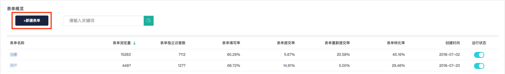
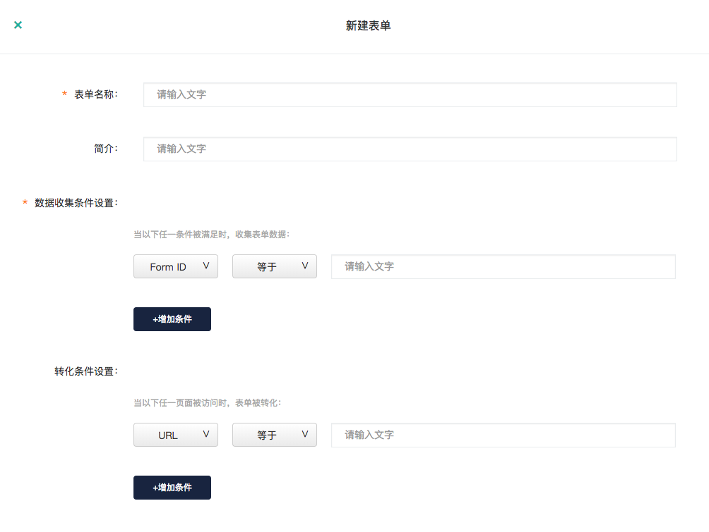
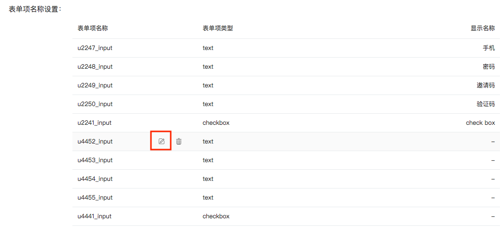
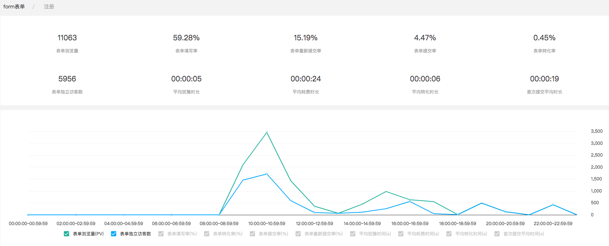
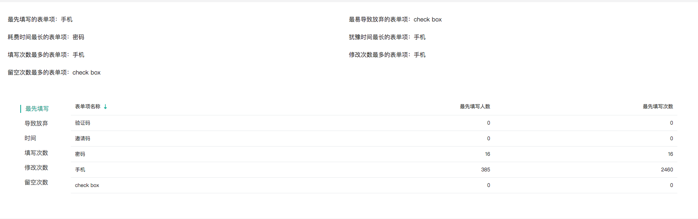
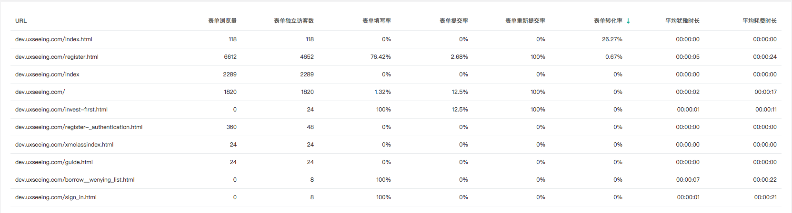

# 2.3.5表单

## 1、什么是表单分析

常见的表单有注册表单、登录表单、添加购物车表单等，用于收集不同类型的用户输入。表单中的元素通常有以下几种：文本域、下拉列表、单选框、复选框、提交按钮等。 知了客户体验云提供在线表单分析工具，统计您网站的表单数据，可助您了解访客与表单的互动情况，为您优化表单设计提供参考。主要包括以下功能：

 （1）表单访问、填写、提交、转化情况分析。主要的数据指标有表单浏览量/独立访客数、表单填写率、表单提交率、表单重新提交率、表单转化率。 

（2）访客与表单中各个字段的交互情况分析。主要的分析维度有七个：用户最先填写的表单项；导致用户放弃填写的表单项；用户在每个表单项交互的时长（包括耗费时长与犹豫时长）；每个表单项的填写次数；每个表单项的修改次数；每个表单项的留空次数。 

（3）表单所在的页面访问情况。同一表单可能会存在于不同页面被用户访问，知了客户体验云将对不同页面上的表单被访问情况进行数据统计，帮助分析不同页面上表单的填写率与转化率是否有不同。


### 2、如何设置表单分析？

知了客户体验云将默认获取产品中访问量最高的十个表单。如果您想要统计的表单不在此十个之列，您可以选择新建表单。

```text
Step1:点击页面左上方的“新建表单“按钮
```



```text
Step2:设置表单统计与转化的条件。
```




表单数据收集条件中包含From ID与From名称两个选项，Form ID与Form名称指的是开发人员在编程中为该表单所设置的ID或名称，如果您在填写过程中对这两项有疑问，可以咨询开发人员获得From ID与Form 名称。


```text
Step3:编辑表单中每个表单项的名称。系统所获取到的表单项名称通常难以辨识，可以将其编辑成可辨别的显示名称。
```



  
通过以上3个简单的步骤，点击确认后，一个表单就被设置好了，设置完成后您可在表单页面的表格中查看到新建的表单及相关数据。

### 3、如何使用表单分析？

在成功设置了表单之后，即可查看表单的详细数据，知了客户体验云所提供的表单数据可分为以下4个主要部分进行查看：

```text
Part1: 表单概览表格
```

在该表格中可以查看所有表单的统计数据，并可根据不同数据维度进行正序/倒序排序。点击任意一行可以进入到该行的表单详情页。


```text
Part2: 表单数据详情及趋势图
```

表单数据详情及趋势图，可以查看该表单在不同时间的整体走势。举例来说，如果在6月28日针对该表单进行了优化设计，则可以通过趋势图了解6月28前后该表单的填写率、转化率等数据的变化情况，查看优化设计是否有正向的效果。



```text
Part3:表单项详情
```

表单项详情包括7个统计维度：用户最先填写的表单项；导致用户放弃填写的表单项；用户在每个表单项交互的时长（包括耗费时长与犹豫时长）；每个表单项的填写次数；每个表单项的修改次数；每个表单项的留空次数。表格最上方有各维度的汇总报告。

通过这些数据，可以迅速了解到表单中哪个表单项出现了问题，哪些表单需要进行改进，从而有效提高表单转化率。



```text
Part4:表单受访页面详情
```

同一表单可能被设置在不同的页面之中，在不同的页面中表单被访问的次数会有差异，同时，表单的填写率与转化率也可能会有极大不同，通过表单受访页面表格，可以对数据进行排序，如对转化率进行倒序排序，找出该表单所在页面中转化率最高的页面。



### 4、表单能解决什么问题？

知了客厅体验云的表单分析工具可助您了解访客与表单的互动情况和趋势变化，通过多维度数据指标掌握影响访客填写表单的用户体验问题，为您优化表单设计提供参考建议，以减少访客在填写表单时的阻碍，促进表单转化效果。

应用场景举例：

（1）有多少访客访问了网站表单，与表单进行了互动？有多少人成功提交了表单？

（2）表单中哪个字段导致了访客放弃填写表单？哪个字段用户不愿意填写？

（3）用户填写哪个字段耗时比较费时、费力?

（4）用户在哪个字段上的重填率、修改率较高？原因是？

表单分析工具可以有效解决以下分析痛点。例如：

（1）表单访问、填写、提交、转化数据能够显示有多少访客与表单进行了互动，有多少访客成功地完成了它，又有多少访客尝试了但未能提交成功，从数据表现上发现可能存在用户体验设计问题的表单。

（2）表单项交互数据能够显示访客与表单中各个字段的交互情况，哪些字段是访客开始填写的字段，哪些字段是访客最后互动的字段，哪些字段耗费时间最长，哪些字段存在频繁修改的现象。这些数据可以帮助您定位存在设计问题的字段，您可以及时修改或删除该字段，以提高访客填写表单的效率，让访客填写更容易。

#### 

