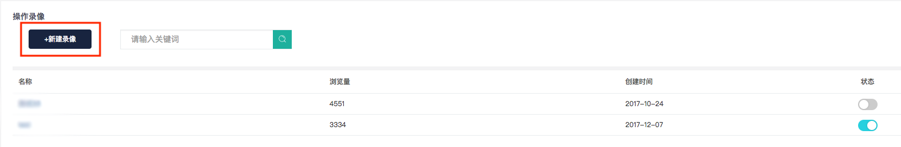
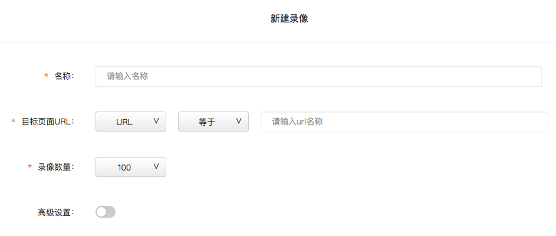
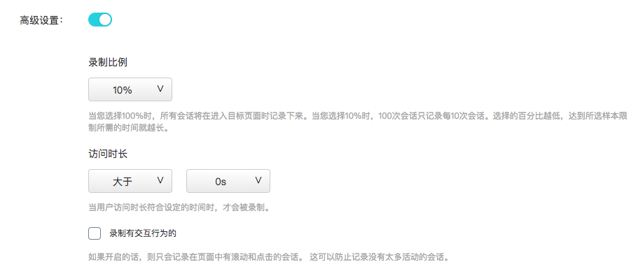

# 2.3.4 操作录像

## 1、操作录像简介

操作录像即对用户在网站或APP上的会话进行录制。通过会话录制，您可以查看用户在产品上的所有活动，例如点击，鼠标移动，滚动，窗口大小调整，页面更改以及特定页面上真实访问者的表单交互。您可以在视频中重播这些互动，以准确了解用户与您产品的互动方式。通过这种方式，您可以了解他们的期望，他们可能遇到的问题，使用模式等。


## 2、如何设置录像？

```text
Step1: 点击页面左上方的“新建录像“按钮
```



```text
Step2: 设置需要进行录像统计的页面URL
```



```text
Step3（选填）: 对录像统计进行高级条件设置
```



```text
Step4: 
```



为了用户隐私考虑，我们将用户输入\(地址、电子邮件、信用卡信息、用户名、电话号码……\)的字段如果被我们检测到，将会自动屏蔽。用户输入的任何字符都用星号\(\*\)代替。


## 3、录像的应用场景

录像功能其实就像是人眼追踪技术（Eye-Tracking），但是只需要花费几分钟即可进行设置，相较于人眼追踪技术来说，录像功能更加便捷迅速，且可以节约大量成本。简而言之，录像功能就是把用户真实使用产品，与页面交互的过程记录并保存下来，供产品开发者随时观看与应用，进行数据的统计及分析。

录像能够记录用户真实操作过程的功能，记录用户与页面交互的细节动作，如鼠标点击、移动、滚动等等，基于此功能，其可应用于分析的场景其实有很多，但最重要的应用场景有以下两种：

（1）可用性测试

传统的可用性测试需要邀请用户到实验室、分配任务、对用户的操作过程进行录像。但不可否认地是，在实验室环境中非真实场景下测试始终存在一定偏差。而有效地使用操作录像，则可以替代甚至超越传统的可用性测试。操作录像保证了“真实场景“与“真实用户“这两个非常重要的条件，不仅能有效缩短可用性测试所需耗费的准备时间，更是极大地提高了测试的效率，降低了测试的成本。

（2）精准分析

如今的互联网时代，已经不再是从前的粗放式时代，一切分析、调研、设计与运营都走向了精细化与精准化的道路。我们对于数据的分析也不再是在茫茫数据海洋中寻找可能隐藏于海平面之下的浮冰，数据统计技术的进步让数据中隐藏的问题可以更加快速明显的暴露出来。而操作录像则是对于这些暴露出来的问题进行精准分析的有效工具之一。

举例来说，XXX金融产品新推出一个“砸金蛋送豪礼“活动，在知了客户体验云中建立了转化路径来监测该活动的转化情况，产品经理发现活动事件点击次数高，但是转化率却很低，大量用户在进入活动介绍页面后就迅速退出。此时，产品经理发现了活动介绍页面存在问题，他可以针对该页面建立一个录像，观察用户的操作，最终发现用户对活动砸金蛋的交互方式不理解，砸金蛋需要鼠标连续单击蓄力砸。设计师重新优化了砸金蛋的交互，单击即可砸破金蛋。上线后，转化率提高了200%。

#### 

