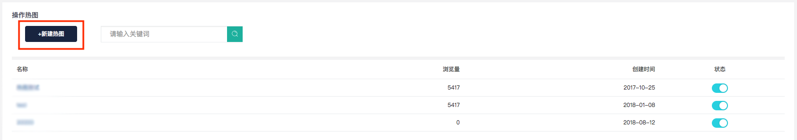
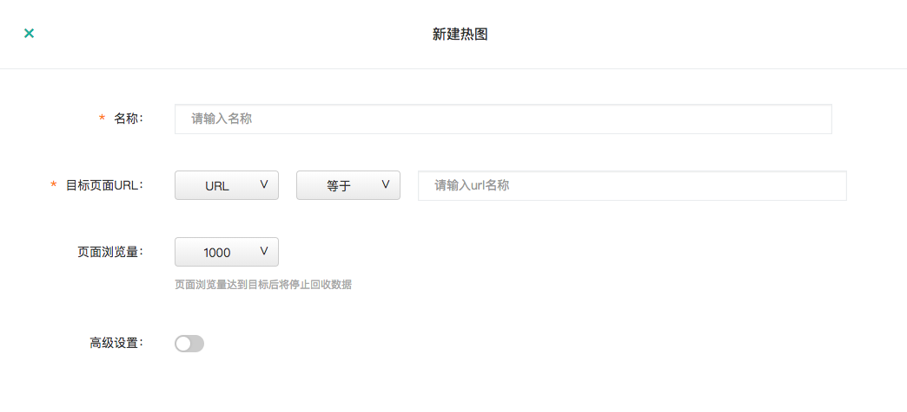
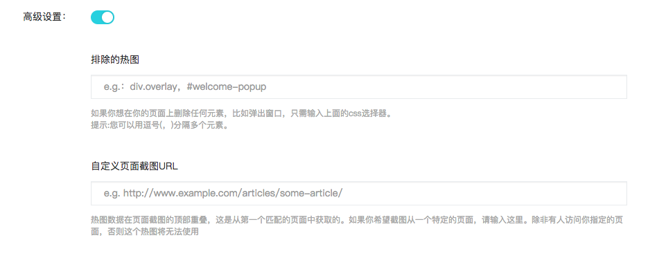

# 2.3.3 热图

操作热图简介 操作热图\(heatmap\)是以热谱图展示用户在页面点击或浏览行为的图示。借助热图，您可以直观地查看特定页面内用户所有点击，鼠标移动和滚动。例如，这可以帮助您找出用户更关注那些内容，判断关键内容是否被用户所接受。 知了行为统计提供的热力图支持三种模式：点击热图、浏览热图、分屏热图。 

操作热图的类型 

### 1、点击热图\(Click and Tap Heatmaps\)

点击热图可以帮助您确定用户点击的位置。如果他们在移动设备/平板电脑上使用，他们的触屏动作也会被记录。点击热图可以帮助您快速发现网页的问题： 例如，用户是否点击了您希望他们点击的区域？ 


知了行为统计会记录页面中所包含的所有访客的点击或触屏动作，并自动生成访客点击区域的可视化表示。为显示页面特定区域被点击的频次，知了行为统计使用以下色阶来区分不同点击频次。



红色表示最常被点击的元素/区域，右端的数值表示页面区域被点击次数的最大值；而蓝色表示最少点击的区域，左端的数值表示页面区域被点击次数的最小值。页面上不包含颜色的区域表示从未被用户点击过的区域。


### 2、浏览热图（Move Heatmaps）


### 3、分屏热图（Scroll Heatmaps）

通过分屏热图掌握每屏内容对于用户的吸引力，我们都知道用户浏览行为可能越往下浏览率越低，但是具体情况如何，一直没有实际的数据支撑。分屏热图创新性的将每一屏的浏览用户数和比例直观的展现出来。因此在产品功能、页面内容的展示方面，可以根据分屏热图进行优化，提高重要信息的曝光度。 首屏对用户的第一印象决定了用户是否有兴趣继续向下浏览，如果通过分屏热图发现首屏到第二屏流失非常高，那就应该考虑优化首屏的展示效果了。


知了行为统计跟踪您的每个访客在浏览页面时向下滚动屏幕的距离，通过分析页面访客的数量与每个访客滚动屏幕到页面下方的深度来呈现数据

通过分屏热图掌握每屏内容对于用户的吸引力，我们都知道用户浏览行为可能越往下浏览率越低，但是具体情况如何，一直没有实际的数据支撑。分屏热图创新性的将每一屏的浏览用户数和比例直观的展现出来。因此在产品功能、页面内容的展示方面，可以根据分屏热图进行优化，提高重要信息的曝光度。 首屏对用户的第一印象决定了用户是否有兴趣继续向下浏览，如果通过分屏热图发现首屏到第二屏流失非常高，那就应该考虑优化首屏的展示效果了

您可以将鼠标置于分屏热图之上，查看不同位置的标记，了解访客到达页面特定位置的百分比。为显示页面特定区域被点击的频次，知了行为统计使用以下色阶来区分不同点击频次。



 红色表示最常被最多访客查看的区域，右端的数值“100%“表示页面区域被访客查看的最大值，即所有访客都查看了的区域；而蓝色表示最常被最少访客查看的区域，左端的数值 “37.2%”表示该页面区域被访客查看的最小值。


### 4、如何设置热图？

```text
Step1: 点击页面左上方的"新建热图"按钮
```



```text
Step2:设置需要进行热图统计的页面URL
```



```text
Step3（选填）:对热图统计进行高级条件设置
```



```text
Step4:查看热图详情
```

### 5、应用场景 

某保险公司的报价着落页更新改版后，访问时长数据、跳出率等数据与之前老版相差无几，但是转化率比之前低。设置操作热图后，通过浏览热图发现用户的视觉焦点并非落在报价计算器中，而是被其他视觉元素所吸引。通过观察点击热图发现报价计算器中的点击数量远低于界面其他元素。证明用户都点击其他元素跳转流失了。通过优化设计，减弱了界面其他视觉元素的干扰，突出报价计算器视觉效果。优化后转化率比优化前转化提升了200%。

