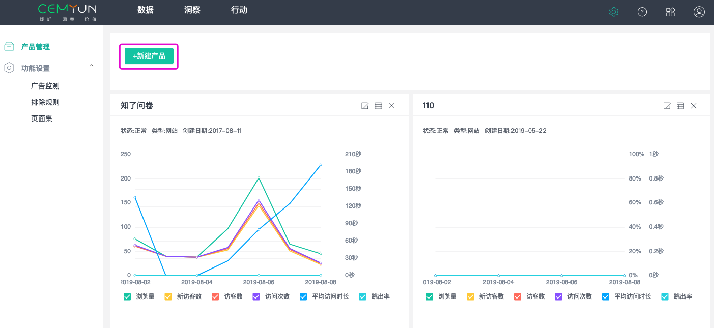
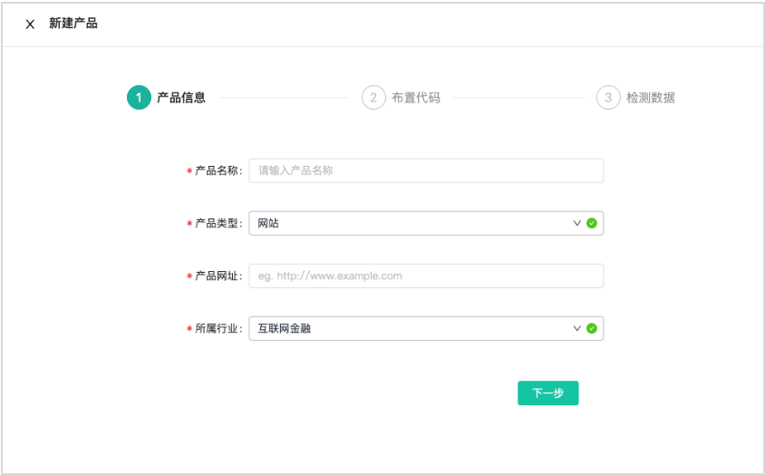
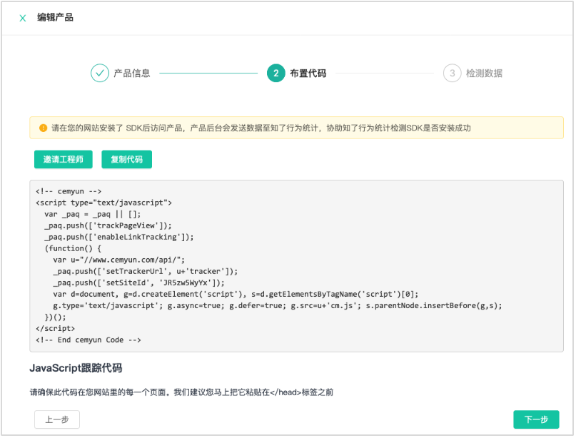
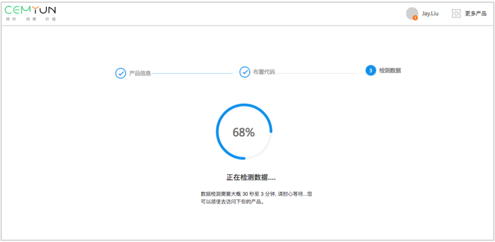
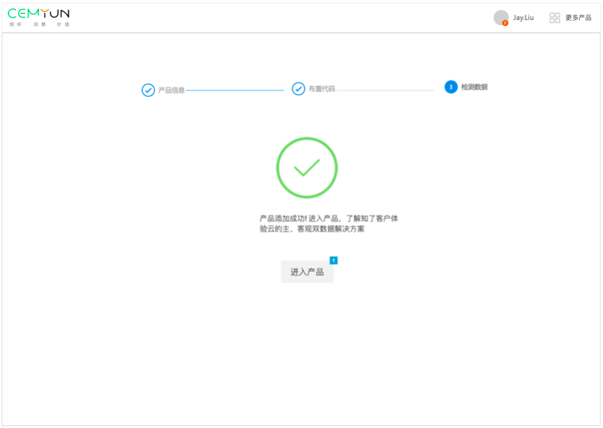
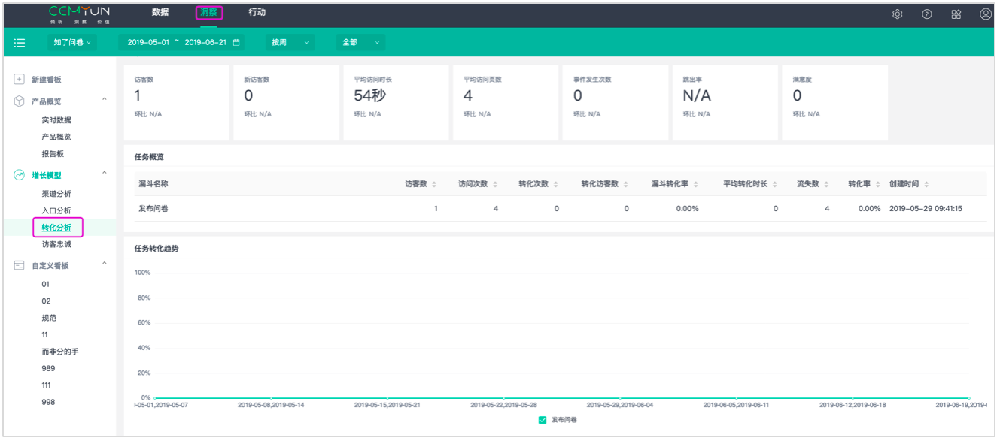

# 新手引导

**知了客户体验云介绍**

是基于用户行为的新一代数据分析产品，吸取了国内外数据分析的最佳实践，创新了一套主、客观双数据分析方案、简单易上手的分析模板、通俗易懂直接呈现数据根因的报告板，展现分析的一站式解决方案。

我们希望：

帮助客户快速、精准实现业务洞察，发现产品中存在的问题，帮助客户分析行为和业务数据，快速提高业务转化

帮助客户管理用户生命周期，精细化用户运营

在使用知了客户体验云之前，您需要进行以下配置：

是基于用户行为的新一代数据分析产品，吸取了国内外数据分析的最佳实践，创新了一套主、客观双数据分析方案、简单易上手的分析模板、通俗易懂直接呈现数据根因的报告板，展现分析的一站式解决方案。

我们希望：

帮助客户快速、精准实现业务洞察，发现产品中存在的问题，帮助客户分析行为和业务数据，快速提高业务转化

帮助客户管理用户生命周期，精细化用户运营

在使用知了客户体验云之前，您需要进行以下配置：

### 1.1新建产品

进入产品管理页面，点击新建产品，进行新建产品信息的填写。

#### 1.1.1填写产品信息

 第一步：填写产品信息，选择产品类型和行业。

第二步：点击进入下一步，布置SDK。

#### 1.1.2布置SDK 

布置SDK时，请确保此代码在您网站里的每一个页面，我们建议您把它粘贴在&lt;/head&gt;标签之前，请勿单独放置在js文件中。 您可以直接点击复制代码，将代码复制后发送给工程师；也可以点击邀请工程师按钮，按流程邀请工程师介入安装。

#### 1.1.3检测数据

安装代码后，就可以进行数据检测。数据检测需要大概 30 秒至 3 分钟, 请耐心等待...您可以顺便去访问下你的产品，产生数据以便让系统快速检测到数据。

检测成功，表示产品添加成功! 即可进入产品查看数据，了解知了客户体验云的主、客观双数据解决方案。

检测失败，说明系统未收到你的应用数据，可能存在以下原因： （一）代码没有放置  和 之间 （二）网址不能是 localhost 或 IP 格式，请换成域名格式的地址 有相关疑问请联系客服或查看开发文档

### 1.2增长模型-解决方案介绍

我们关注访客在网站的全生命周期，我们提供了从获取访客到访客转化最后访客传播分享的全流程优化分析模板，帮助您更好地完成访客增长目标。

####  1.2.1渠道分析模板

 渠道分析可以对通过对各个渠道进行数据检测，对比分析各个渠道访客的数量、质量等数据、筛选出最优渠道。分析访客搜索关键词，了解访客都关注什么内容。网站内容是否与访客想要的匹配。

#### 1.2.2入口页分析模板

 在入口页分析看板中我们可以了解到访客都是从哪些页面进入您的网站的，哪些入口页面的跳出数多，需要重点优化的，哪些页面吸引了更多访客进入其他页面，哪些页面是比较吸引访客的。

#### 1.2.3目标转化模板

 目标转化是你希望用户在你产品完成的一系列目标，例如：你希望用户来了就立即注册，注册了就立即购买。注册，购买就是产品的目标，我们可以通过目标转化看板分析有多少访客完成了目标，完成目标的访客用时是多长，放弃的访客是在那一步骤放弃的。最后还能知道访客放弃的原因是什么，可以针对放弃原因性的优化

#### 1.2.4访客忠诚模板

 通过访客忠诚可以了解到有多少访客是只来了一次就不再来了，有多少访客会经常来，又有多少访客会再次访问网站。

### 1.3引导配置任务

 如果已经检测到数据，进入产品默认显示产品的概览数据，可以切换查看不同的分析模板进行分析。 为了更好的分析产品，可以设置事件、产品转化目标、广告追踪和看板，方便您精准高效地监控产品。

#### 1.3.1如何布置事件代码 

事件指的是用户在您产品上做了什么事，即用户行为，这种行为可以是任何事情，通常情况下，事件用于跟踪页面中元素的点击，如菜单、小部件、Flash元素、Ajax操作等等。常见的事件有：注册、登录、点击了某个按钮、浏览商品、添加购物车、分享了某篇文章等。 知了客户体验云提供事件分析工具，统计您网站的事件数据，可助您了解访客在您网站上的行为动态，为您优化网站交互元素提供参考。 您需要对要分析的事件进行埋点，按照下方格式，梳理所有要埋点的事件，交给开发人员进行埋点。

埋点说明：在响应点击/开始/停止/下载等事件时，在JS中调用事件跟踪代码。将事件埋点代码布置在点击方法中即可， 

例如：

&lt;a onclick="\_hmt.push\(\['\_trackEvent', 'nav', 'click', 'literature'\]\)"

href="http://www.example.com/literature"&gt;文学&lt;/a&gt;

