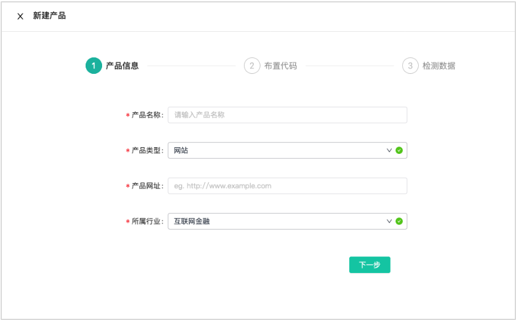
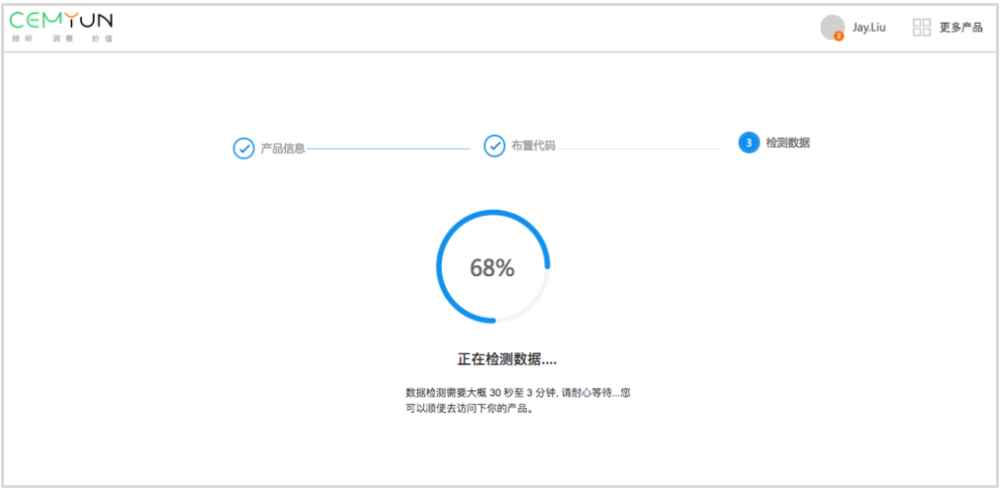

# 1.1新建产品

#### 1.1.1填写产品信息

```text
Step1:第一步：进入产品管理页面，点击新建产品，在弹窗中进行新建产品信息的填写。
```




```text
Step2:第二步：点击进入下一步，布置SDK。
```

布置SDK时，请确保此代码在您网站里的每一个页面，我们建议您把它粘贴在&lt;/head&gt;标签之前，请勿单独放置在js文件中。 您可以直接点击复制代码，将代码复制后发送给工程师；也可以点击邀请工程师按钮，按流程邀请工程师介入安装。


```text
Step3:第三步：检测数据
```

安装代码后，就可以进行数据检测。数据检测需要大概 30 秒至 3 分钟, 请耐心等待...您可以顺便去访问下你的产品，产生数据以便让系统快速检测到数据。



检测成功，表示产品添加成功! 即可进入产品查看数据，了解知了客户体验云的主、客观双数据解决方案。


检测失败，说明系统未收到你的应用数据，可能存在以下原因： 


（一）代码没有放置&lt;head&gt;和&lt;/head&gt;之间 

（二）网址不能是 localhost 或 IP 格式，请换成域名格式的地址 有相关疑问请联系客服或查看开发文档



### 

