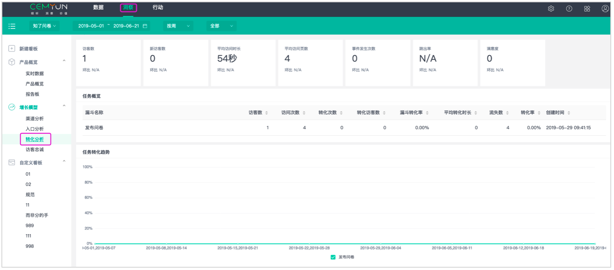

# 增长模型-解决方案介绍

### 1.2增长模型-解决方案介绍

我们关注访客在网站的全生命周期，我们提供了从获取访客到访客转化最后访客传播分享的全流程优化分析模板，帮助您更好地完成访客增长目标。

####  1.2.1渠道分析模板

 渠道分析可以对通过对各个渠道进行数据检测，对比分析各个渠道访客的数量、质量等数据、筛选出最优渠道。分析访客搜索关键词，了解访客都关注什么内容。网站内容是否与访客想要的匹配。

#### 1.2.2入口页分析模板

 在入口页分析看板中我们可以了解到访客都是从哪些页面进入您的网站的，哪些入口页面的跳出数多，需要重点优化的，哪些页面吸引了更多访客进入其他页面，哪些页面是比较吸引访客的。

#### 1.2.3目标转化模板

 目标转化是你希望用户在你产品完成的一系列目标，例如：你希望用户来了就立即注册，注册了就立即购买。注册，购买就是产品的目标，我们可以通过目标转化看板分析有多少访客完成了目标，完成目标的访客用时是多长，放弃的访客是在那一步骤放弃的。最后还能知道访客放弃的原因是什么，可以针对放弃原因性的优化

#### 1.2.4访客忠诚模板

 通过访客忠诚可以了解到有多少访客是只来了一次就不再来了，有多少访客会经常来，又有多少访客会再次访问网站。

### 

