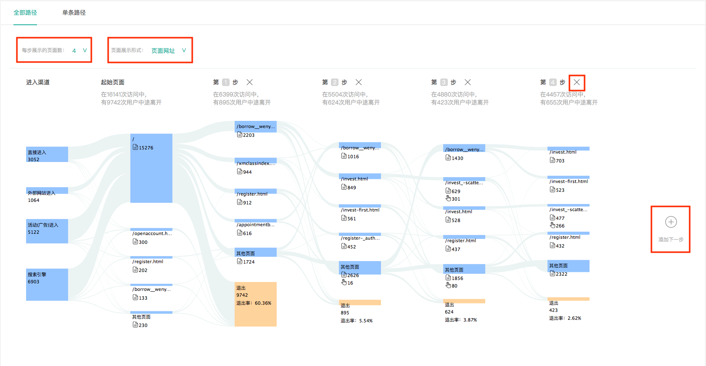
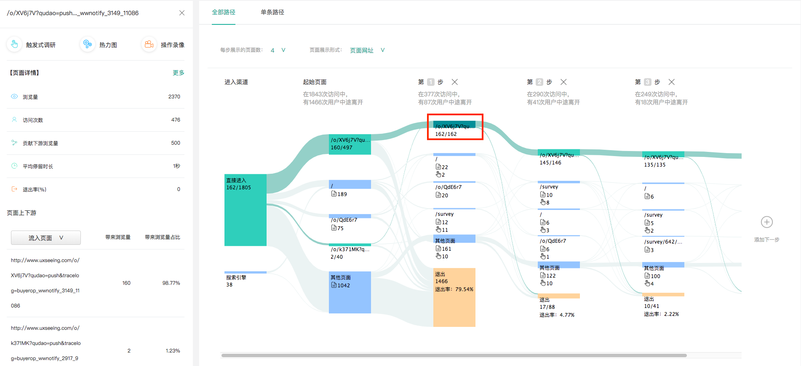

# 用户路径

### 1、为什么需要用户路径？

通过用户路径，你可以发现用户在你的网站或APP上访问的真实路径。了解在真实使用场景中，用户是否按照你所设计的转化流程在进行浏览与操作。如果不是，那么用户在哪一步骤或页面遇到了问题，用户在哪个页面的退出率最高，哪个页面阻碍了用户完成转化等等。根据这些信息，您可以有针对性地改进您的网站或APP，从而高效地提升转化。

知了客户体验云通过用户路径分析，可视化用户流，可助您全面了解整体行为路径，从而为优化网站页面路径提供参考，以提升网站吸引力。

### 2、用户路径的表现形式

在知了客户体验云中，用户路径有两种呈现形式：全部路径与单条路径。

全部路径是整个网站/APP上用户所访问过的所有真实路径的集合，用桑基图进行显示，纵览整个产品的用户路径走向。单条路径则是将用户的所有真实路径以单条的形式呈现出来，以便进行数据上的排序与对比。因此，从本质上讲，全部路径与单条路径都是用户的真实路径，只是同一数据的不同表现形式。简单来说，将所有的单条路径集合在一起，就构成了全部路径。

### 3、如何查看全部路径？

点击左侧功能栏“用户路径”可以进入用户路径模块，默认显示“全部路径“，如下图所示。

**功能点一：桑基图上方有两个筛选框：**

（1）每步展示的页面数；例如，如果选择每步展示页面数为4，则下方桑基图每列（纵向）会展示访问量最高的4个页面，剩余页面则被归为其他页面中。

（2）页面展示形式：页面展示形式有2种：页面网址与页面标题。选择页面网址则下方的桑基图上会显示每个页面的URL，选择页面标题，则会显示页面的名称。

**功能点二：桑基图有添加步骤与删减步骤的功能：**

（3）添加下一步：点击桑基图最右侧的➕按钮，则会展开桑基图的下一步。

（4）删减步骤：在桑基图的每个步骤上方有一个❌号，点击叉号即可删减该步骤。

**功能点三：高亮功能**

（5）点击桑基图中任意一段连线，可以高亮所有经过该路径连线的页面及流量。

（6）点击桑基图中任意一个页面，可以高亮所有经过该页面的路径情况，同时页面左侧会出现侧边栏，显示该页面的详情数据：包括页面数据，页面上下游，页面调研结果等。

### 4、如何查看单条路径？

点击页面上方的“单条路径“，即可看到单条路径的表格。如下图所示。

单条路径表格展示的是用户所访问过的所有真实的路径，可以通过访问深度、访问量、平均访问时长三个维度，对路径进行排序，筛选出您想要查看的用户路径。

（1）点击任意一条路径最左侧的➕号，可展开查看该路径的每一步骤，如下图所示：

（2）鼠标探上表格中的任意一行路径，出现路径详情按钮，点击该按钮则可以查看该条路径的数据详情。如下图所示：

### 5、用户路径的应用场景

用户路径的使用场景有很多，其最核心的功能就是帮助我们了解产品的用户在真实使用场景下是如何访问网站或APP的，可以帮助我们对产品进行有针对性的改进，以提高用户体验与用户转化率。以下是用户路径应用场景的举例说明：

（1）了解用户进行购买或转化的真实路径，查看用户是否有按照产品所设计的流程进行访问。

（2）探究用户访问的路径中转化率最高与最低的分别是哪条路径，应该考虑更加优化转化率高的路径，改进转化率低的路径；

（3）查看退出率高的页面有哪些，如在某些页面或路径出现异常高的退出率，则可以通过知了体验云的触发式调研功能对用户进行调研，或者通过对页面热图进行分析，或者通过查看用户的操作录像来发现问题所在，有针对性的解决问题，以有效降低关键页面的退出率，提升路径的转化率。

